# Puerto Team Structure

**Digital Agency Organization - 8 Departments, 27 Specialized Roles**

---

## Organization Chart

```mermaid
graph TB
    CEO[Chief Strategy Officer<br/>leadership]

    subgraph Engineering[Engineering Department - 7 roles]
        EL[Engineering Lead]
        FE[Frontend Engineer]
        BE[Backend Engineer]
        DE[DevOps Engineer]
        ME[Mobile Engineer]
        DTE[Data Engineer]
        QA[QA Engineer]
    end

    subgraph Design[Design Department - 4 roles]
        DL[Design Lead]
        UR[UX Researcher]
        UW[UX Writer]
        AS[Accessibility Specialist]
    end

    subgraph Marketing[Marketing Department - 5 roles]
        MD[Marketing Director]
        CS[Content Strategist]
        SE[SEO Specialist]
        SM[Social Media Manager]
        GM[Growth Marketer]
    end

    subgraph Product[Product Department - 4 roles]
        CPO[Chief Product Officer]
        PM[Project Manager]
        BA[Business Analyst]
        DA[Data Analyst]
    end

    subgraph Sales[Sales Department - 3 roles]
        SD[Sales Director]
        CSM[Customer Success Manager]
        PAM[Partnership Manager]
    end

    subgraph Operations[Operations Department - 3 roles]
        OL[Operations Lead]
        HR[HR Manager]
        OM[Office Manager]
    end

    CEO --> EL
    CEO --> DL
    CEO --> MD
    CEO --> CPO
    CEO --> SD
    CEO --> OL

    EL --> FE
    EL --> BE
    EL --> DE
    EL --> ME
    EL --> DTE
    EL --> QA

    DL --> UR
    DL --> UW
    DL --> AS

    MD --> CS
    MD --> SE
    MD --> SM
    MD --> GM

    CPO --> PM
    CPO --> BA
    CPO --> DA

    SD --> CSM
    SD --> PAM

    OL --> HR
    OL --> OM

    style CEO fill:#e1f5ff
    style EL fill:#fff3e0
    style DL fill:#f3e5f5
    style MD fill:#e8f5e9
    style CPO fill:#fff9c4
    style SD fill:#fce4ec
    style OL fill:#e0f2f1
```



---

## ASCII Organization Chart

```
                    ┌─────────────────────────────┐
                    │  Chief Strategy Officer     │
                    │  (leadership)               │
                    └──────────────┬──────────────┘
                                   │
         ┌──────────┬──────────┬───┴───┬──────────┬──────────┬──────────┐
         │          │          │       │          │          │          │
    ┌────▼───┐ ┌───▼────┐ ┌───▼───┐ ┌▼────────┐ ┌▼───────┐ ┌▼─────────┐
    │Engineer│ │ Design │ │Market │ │ Product │ │ Sales  │ │Operations│
    │  Lead  │ │  Lead  │ │Director│ │   CPO   │ │Director│ │   Lead   │
    └────┬───┘ └───┬────┘ └───┬───┘ └┬────────┘ └┬───────┘ └┬─────────┘
         │         │          │       │           │          │
    ┌────┴──────┐  │     ┌────┴────┐  │      ┌────┴───┐     │
    │           │  │     │         │  │      │        │     │
┌───▼──┐ ┌─────▼┐ │  ┌──▼──┐ ┌───▼┐ │  ┌───▼──┐ ┌──▼──┐ ┌─▼──┐
│Front │ │Backend│ │  │Content│ │SEO│ │  │Cust. │ │Partner│ │ HR │
│ End  │ │Engineer│ │  │Strat. │ │Spec│ │  │Success│ │Manager│ │Mgr │
└──────┘ └───────┘ │  └──────┘ └───┘ │  └──────┘ └──────┘ └────┘
                   │                  │
┌────────┐ ┌──────▼┐ ┌────────┐ ┌───▼──┐ ┌──────────┐ ┌────────┐
│DevOps  │ │   UX   │ │Social  │ │Project│ │  Data    │ │ Office │
│Engineer│ │Research│ │ Media  │ │Manager│ │ Analyst  │ │Manager │
└────────┘ └────────┘ └────────┘ └───────┘ └──────────┘ └────────┘

┌────────┐ ┌────────┐ ┌────────┐ ┌─────────┐
│Mobile  │ │   UX   │ │ Growth │ │Business │
│Engineer│ │ Writer │ │Marketer│ │ Analyst │
└────────┘ └────────┘ └────────┘ └─────────┘

┌────────┐ ┌────────────┐
│  Data  │ │Accessibility│
│Engineer│ │ Specialist  │
└────────┘ └────────────┘

┌────────┐
│   QA   │
│Engineer│
└────────┘

ENGINEERING (7)    DESIGN (4)    MARKETING (5)    PRODUCT (4)    SALES (3)    OPERATIONS (3)
```

---

## Department Breakdown

### 🔧 Engineering Department (7 roles)
**Leadership:** Engineering Lead
**Reports to:** Chief Strategy Officer

**Team:**
1. **Frontend Engineer** - React, Vue, UI/UX implementation
2. **Backend Engineer** - APIs, databases, system architecture
3. **DevOps Engineer** - CI/CD, infrastructure, deployments
4. **Mobile Engineer** - iOS, Android, React Native
5. **Data Engineer** - Data pipelines, ML ops, analytics infrastructure
6. **QA Engineer** - Testing, quality assurance, automation

**Scope:** All technical development, from frontend to infrastructure

---

### 🎨 Design Department (4 roles)
**Leadership:** Design Lead
**Reports to:** Chief Strategy Officer

**Team:**
1. **UX Researcher** - User research, testing, insights
2. **UX Writer** - Content strategy, microcopy, voice/tone
3. **Accessibility Specialist** - WCAG compliance, inclusive design

**Scope:** All design work, from research to visual identity to accessibility

---

### 📢 Marketing Department (5 roles)
**Leadership:** Marketing Director
**Reports to:** Chief Strategy Officer

**Team:**
1. **Content Strategist** - Content planning, writing, distribution
2. **SEO Specialist** - Technical SEO, on-page, local, content optimization
3. **Social Media Manager** - Social strategy, community management
4. **Growth Marketer** - Acquisition, conversion, retention, experiments

**Scope:** All marketing activities, from content to growth to analytics

---

### 📊 Product Department (4 roles)
**Leadership:** Chief Product Officer
**Reports to:** Chief Strategy Officer

**Team:**
1. **Project Manager** - Agile delivery, coordination, timelines
2. **Business Analyst** - Requirements, process optimization, stakeholder management
3. **Data Analyst** - Metrics, dashboards, insights, reporting

**Scope:** Product strategy, project execution, business analysis, analytics

---

### 💼 Sales Department (3 roles)
**Leadership:** Sales Director
**Reports to:** Chief Strategy Officer

**Team:**
1. **Customer Success Manager** - Onboarding, retention, support
2. **Partnership Manager** - Alliances, integrations, channel partnerships

**Scope:** Revenue generation, customer relationships, partnerships

---

### ⚙️ Operations Department (3 roles)
**Leadership:** Operations Lead
**Reports to:** Chief Strategy Officer

**Team:**
1. **HR Manager** - Recruitment, talent management, culture
2. **Office Manager** - Procurement, facilities, administration

**Scope:** Internal operations, HR, procurement, office management

---

### 🎯 Leadership (1 role)
1. **Chief Strategy Officer** - Company vision, strategic planning, executive reporting

**Scope:** Strategic planning, vision, executive communication

---

## Team Size by Department

| Department | Roles | % of Team |
|------------|-------|-----------|
| Engineering | 7 | 26% |
| Design | 4 | 15% |
| Marketing | 5 | 19% |
| Product | 4 | 15% |
| Sales | 3 | 11% |
| Operations | 3 | 11% |
| Leadership | 1 | 4% |
| **Total** | **27** | **100%** |

---

## Collaboration Patterns

### Cross-Department Workflows

**Product Development Flow:**
```
Strategy Officer → Product Officer → Engineering Lead → QA Engineer → DevOps Engineer
              ↓           ↓                ↓
          Design Lead  Data Analyst    Frontend/Backend/Mobile
```

**Marketing Campaign Flow:**
```
Marketing Director → Content Strategist → SEO Specialist → Growth Marketer
              ↓              ↓                    ↓
          Design Lead   Social Media      Data Analyst
```

**Customer Acquisition Flow:**
```
Sales Director → Partnership Manager → Customer Success Manager
        ↓                                    ↓
  Marketing Director                 Product Officer
```

---

## Reporting Lines

### Direct Reports to Chief Strategy Officer (6)
1. Engineering Lead
2. Design Lead
3. Marketing Director
4. Chief Product Officer
5. Sales Director
6. Operations Lead

### Second-Level Reports (20)
- Engineering Lead → 6 engineers
- Design Lead → 3 designers
- Marketing Director → 4 marketers
- Chief Product Officer → 3 product/project roles
- Sales Director → 2 sales roles
- Operations Lead → 2 operations roles

---

## Role Distribution Analysis

**Technical Roles:** 13 (48%)
- Engineering: 7
- Design: 4
- Operations: 2 (technical ops)

**Business Roles:** 14 (52%)
- Marketing: 5
- Product: 4
- Sales: 3
- Operations: 1 (HR)
- Leadership: 1

**Leadership Roles:** 7 (26%)
- Chief Strategy Officer
- Engineering Lead
- Design Lead
- Marketing Director
- Chief Product Officer
- Sales Director
- Operations Lead

---

## Structure Evolution

| Metric | Previous (100 plugins) | Current (8 departments) | Change |
|--------|------------------------|-------------------------|--------|
| Plugins | 100 | 8 | -92% |
| Agents | 300-400 | 27 | -93% |
| Structure | Function-based | Department-based | Streamlined |
| Leadership | None explicit | 7 explicit leads | +7 roles |
| Organization | Flat | Hierarchical | Clear reporting |

---

**Version:** 1.0.0
**Last Updated:** 2025-11-03
**Structure Type:** Digital Agency with 8 functional departments
