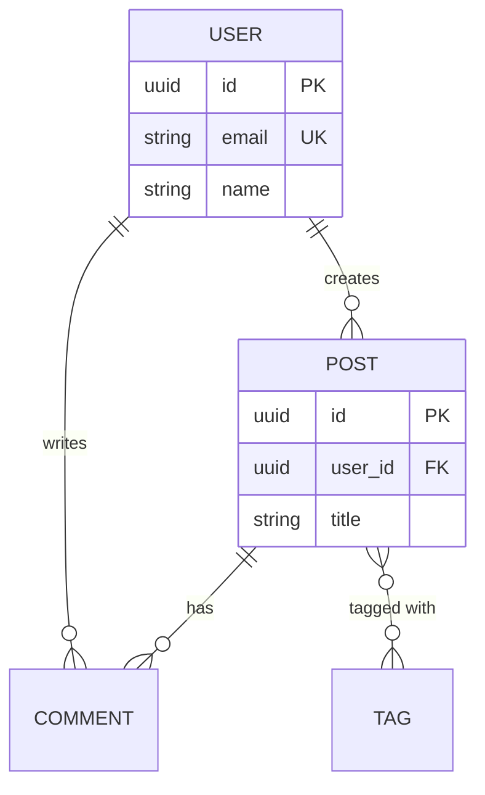

# Backend Architect Plugin

**Comprehensive backend architecture design with ADRs, API specifications, and database schemas**

## Overview

The Backend Architect plugin provides three specialized agents for designing scalable, maintainable backend systems. Each agent focuses on a specific aspect of backend architecture and leverages expert skills for professional-quality deliverables.

## Features

✅ **System Architecture**: ADRs, architecture diagrams, technology stack recommendations
✅ **API Design**: OpenAPI 3.0 specifications, REST/GraphQL patterns, versioning strategies
✅ **Database Schema**: ER diagrams, SQL migrations, indexing strategies, performance optimization
✅ **Scalability Planning**: Horizontal/vertical scaling, caching, partitioning
✅ **Best Practices**: Industry-standard patterns and battle-tested approaches
✅ **Documentation**: Complete, professional documentation for all deliverables

## Architecture

### 3 Specialized Agents

1. **system-architect** (Sonnet - Strategic Planning)
   - Creates Architecture Decision Records (ADRs)
   - Designs system architecture diagrams
   - Recommends technology stacks
   - Plans scalability strategies
   - Tools: Read, Write, Grep, Glob

2. **api-designer** (Sonnet - API Specialist)
   - Creates OpenAPI 3.0 specifications
   - Designs RESTful and GraphQL APIs
   - Documents authentication and authorization
   - Defines versioning and rate limiting strategies
   - Tools: Read, Write, Grep, Glob

3. **database-architect** (Sonnet - Data Modeling)
   - Creates ER diagrams (Mermaid)
   - Designs database schemas (SQL)
   - Plans indexing strategies
   - Creates migration files
   - Optimizes for performance
   - Tools: Read, Write, Grep, Glob

### 3 Comprehensive Skills

1. **architecture-design**: ADR patterns, system design principles, scalability patterns
2. **api-design**: REST/GraphQL best practices, OpenAPI specifications, API versioning
3. **database-design**: Schema design patterns, normalization, indexing strategies

### 4 Professional Templates

- **ADR template**: Architecture Decision Record structure
- **OpenAPI template**: Complete API specification with examples
- **Schema template**: PostgreSQL schema with best practices
- **Diagram templates**: Mermaid diagrams for system architecture

## Installation

### Prerequisites

- Claude Code CLI
- Basic understanding of backend architecture concepts

### Install Plugin

```bash
# Copy to your Claude plugins directory
cp -r plugins/backend-architect ~/.claude/plugins/

# Or use project-level
cp -r plugins/backend-architect .claude/plugins/
```

### Verify Installation

```bash
# Check plugin structure
ls ~/.claude/plugins/backend-architect/
```

## Usage

### Complete Architecture Workflow

**Step 1: System Architecture Design**

"Design the system architecture for a social media platform that needs to support 100K concurrent users"

The system-architect agent will:
- Analyze requirements and constraints
- Design high-level architecture
- Create Architecture Decision Records (ADRs)
- Generate system diagrams (Mermaid)
- Recommend technology stack
- Plan scalability strategy

**Outputs**:
- `docs/architecture/README.md` - Architecture overview
- `docs/architecture/adr/001-choose-microservices.md` - ADR
- `docs/architecture/diagrams/system-architecture.md` - Diagrams
- `docs/architecture/stack.md` - Technology recommendations

**Step 2: API Design**

"Design the REST API for user management, posts, and comments"

The api-designer agent will:
- Design RESTful endpoints
- Create OpenAPI 3.0 specification
- Document authentication (JWT)
- Define error responses
- Plan rate limiting and versioning

**Outputs**:
- `docs/api/openapi.yaml` - OpenAPI 3.0 specification
- `docs/api/README.md` - API documentation
- `docs/api/authentication.md` - Auth guide
- `docs/api/examples.md` - Request/response examples

**Step 3: Database Schema Design**

"Design the database schema for users, posts, comments, and tags"

The database-architect agent will:
- Create ER diagram
- Design normalized schema
- Generate SQL migration files
- Plan indexing strategy
- Optimize for performance

**Outputs**:
- `docs/database/er-diagram.md` - ER diagram (Mermaid)
- `docs/database/schema.sql` - Complete schema
- `migrations/001_create_users.sql` - Migration files
- `docs/database/indexing.md` - Index strategy

## Agent Details

### system-architect

**Trigger**: "Design system architecture", "Create ADR", "Recommend technology stack"

**Capabilities**:
- **ADR Creation**: Documents architectural decisions with context, options, and trade-offs
- **System Diagrams**: Creates Mermaid diagrams for architecture visualization
- **Stack Recommendations**: Technology selection based on requirements and constraints
- **Scalability Planning**: Horizontal/vertical scaling strategies, caching, CDN
- **Pattern Selection**: Monolithic, microservices, event-driven, CQRS, layered

**Output**: Architecture documentation in `docs/architecture/`

**Example ADR**:
```markdown
# ADR-001: Use Microservices Architecture

**Status**: Accepted
**Deciders**: Engineering Team
**Date**: 2025-01-20

## Context
Need to support independent deployment of features with different scaling requirements.

## Decision
Adopt microservices architecture with:
- API Gateway for routing
- Service mesh for inter-service communication
- Separate databases per service

## Consequences
✅ Independent scaling and deployment
✅ Technology flexibility
✅ Team autonomy
❌ Operational complexity
❌ Distributed system challenges
```

### api-designer

**Trigger**: "Design API", "Create OpenAPI spec", "Design REST endpoints"

**Capabilities**:
- **RESTful Design**: Resource-oriented URLs, proper HTTP methods, status codes
- **OpenAPI 3.0**: Complete API specification with schemas, examples, security
- **Authentication**: JWT, API keys, OAuth 2.0 patterns
- **Versioning**: URL, header, or query parameter strategies
- **Rate Limiting**: Request quotas and throttling
- **Error Handling**: Consistent error response formats

**Output**: API documentation in `docs/api/`

**Example OpenAPI**:
```yaml
paths:
  /users:
    get:
      summary: List users
      parameters:
        - name: page
          in: query
          schema:
            type: integer
            default: 1
      responses:
        '200':
          description: Successful response
          content:
            application/json:
              schema:
                type: object
                properties:
                  data:
                    type: array
                    items:
                      $ref: '#/components/schemas/User'
```

### database-architect

**Trigger**: "Design database schema", "Create ER diagram", "Design database structure"

**Capabilities**:
- **ER Diagrams**: Visual database structure using Mermaid
- **Schema Design**: Normalized tables with constraints and relationships
- **Indexing**: Strategic index placement for query performance
- **Migration Files**: Zero-downtime migration strategies
- **Performance**: Query optimization, connection pooling, partitioning
- **Data Types**: Optimal type selection for PostgreSQL/MySQL/MongoDB

**Output**: Database documentation in `docs/database/` and `migrations/`

**Example ER Diagram**:


## Skills Integration

All agents follow a **skills-first approach**:

1. **Read skill** before starting work
2. **Apply expert patterns** from skill library
3. **Generate professional** deliverables
4. **Validate quality** against skill standards

### architecture-design Skill

Expert patterns for:
- ADR template and structure
- Architecture patterns (monolithic, microservices, event-driven)
- Scalability strategies
- Technology selection criteria
- Cost optimization

### api-design Skill

Expert patterns for:
- RESTful API design principles
- OpenAPI 3.0 best practices
- Authentication and authorization
- Versioning strategies
- Error handling
- Rate limiting

### database-design Skill

Expert patterns for:
- Normalization (1NF, 2NF, 3NF)
- ER modeling
- Indexing strategies (B-tree, GIN, partial, composite)
- Data type selection
- Migration patterns
- Performance optimization

## Use Cases

### Use Case 1: Greenfield Project

"I need to design a complete backend for a blogging platform from scratch"

**Workflow**:
1. system-architect: Overall architecture and technology stack
2. api-designer: RESTful API for posts, comments, users
3. database-architect: Schema with proper relationships and indexes

**Result**: Complete architecture documentation ready for implementation

### Use Case 2: System Refactoring

"Our monolithic app is hitting scaling limits, recommend improvements"

**Workflow**:
1. system-architect: Analyze current system, recommend migration to microservices
2. Create ADRs for major architectural changes
3. api-designer: Design service boundaries and APIs
4. database-architect: Plan database sharding or service-specific databases

**Result**: Migration plan with clear decision documentation

### Use Case 3: API Modernization

"Need to add versioning to our existing API and document it properly"

**Workflow**:
1. api-designer: Analyze existing endpoints
2. Create OpenAPI 3.0 specification
3. Add versioning strategy (URL-based recommended)
4. Document authentication and error handling

**Result**: Professional API documentation and versioning plan

### Use Case 4: Performance Optimization

"Database queries are slow, need indexing strategy"

**Workflow**:
1. database-architect: Analyze slow queries with EXPLAIN ANALYZE
2. Recommend indexes (composite, partial, covering)
3. Create migration files for index additions
4. Document query optimization tips

**Result**: Indexing strategy with migration files

## Templates

### ADR Template

Pre-formatted template for Architecture Decision Records:
- Context and problem statement
- Decision drivers
- Considered options
- Decision outcome with pros/cons
- Links to references

Location: `templates/adr-template.md`

### OpenAPI Template

Complete OpenAPI 3.0 specification with:
- Info, servers, security
- Path definitions with examples
- Component schemas
- Reusable parameters and responses
- Authentication schemes

Location: `templates/openapi-template.yaml`

### Schema Template

PostgreSQL schema template with:
- UUID primary keys
- Foreign key relationships
- Indexes for performance
- Triggers for timestamps
- Sample seed data

Location: `templates/schema-template.sql`

### Diagram Templates

Mermaid diagram templates for:
- High-level system architecture
- Data flow sequence diagrams
- Deployment architecture
- Microservices architecture
- ER diagrams
- CI/CD pipeline

Location: `templates/system-diagram-template.md`

## Examples

### Example 1: E-Commerce Backend

**Request**: "Design backend architecture for an e-commerce platform with 50K users"

**System Architect Output**:
```
Architecture Pattern: Microservices
- User Service (user management, auth)
- Product Service (catalog, inventory)
- Order Service (cart, checkout, orders)
- Payment Service (payment processing)
- Notification Service (emails, push)

Technology Stack:
- API Framework: FastAPI (Python)
- Database: PostgreSQL (transactional) + Redis (cache)
- Message Queue: RabbitMQ
- Search: Elasticsearch
- Storage: AWS S3
- Deployment: Docker + Kubernetes

Scalability:
- Auto-scaling for API servers (2-10 instances)
- Read replicas for database
- CDN for product images
- Caching layer (Redis) for hot products
```

**API Designer Output**:
```yaml
# Selected endpoints
POST   /auth/login
GET    /products?category=electronics&page=1
GET    /products/{productId}
POST   /cart/items
POST   /orders
GET    /orders/{orderId}
POST   /payments
```

**Database Architect Output**:
```
Tables: 8
- users, products, categories, orders, order_items, payments, reviews, cart_items

Relationships:
- users -> orders (1:many)
- products -> order_items (1:many)
- orders -> order_items (1:many)
- products -> reviews (1:many)

Indexes: 18 (including composite indexes for common queries)

Performance Optimizations:
- Partial index on published products
- Composite index on (user_id, status) for orders
- GIN index on product descriptions for search
```

### Example 2: SaaS Application

**Request**: "Design multi-tenant SaaS architecture with team workspaces"

**System Architect Output**:
```
Multi-Tenancy Approach: Row-level tenancy (tenant_id in all tables)

Architecture:
- Single database with tenant isolation
- Row-level security policies
- Shared application servers

Benefits:
- Lower operational complexity
- Easier data migrations
- Cost-effective for small/medium scale

Trade-offs:
- All tenants share database resources
- Noisy neighbor problem possible
- Mitigation: Query limits per tenant, monitoring
```

## Best Practices

### Architecture Design

- **Start Simple**: Begin with monolithic, evolve to microservices when needed
- **Document Decisions**: Every major choice gets an ADR
- **Design for Failure**: Assume everything fails eventually
- **Measure Everything**: Add observability from day 1
- **Security First**: Build in security, don't bolt it on later

### API Design

- **Consistency**: Follow REST principles throughout
- **Versioning**: Plan for API evolution from start
- **Documentation**: OpenAPI spec is source of truth
- **Examples**: Provide realistic request/response examples
- **Error Handling**: Use consistent error format

### Database Design

- **Normalize First**: Start with 3NF, denormalize only when needed
- **Index Strategically**: Index for queries, not tables
- **Use Constraints**: Foreign keys, NOT NULL, CHECK enforce integrity
- **Plan Migrations**: Zero-downtime migration strategies
- **Monitor Performance**: EXPLAIN ANALYZE your queries

## Troubleshooting

### Issue: "Agent didn't activate"

**Solution**: Use explicit trigger phrases:
- "Design system architecture for..."
- "Create OpenAPI specification for..."
- "Design database schema for..."

### Issue: "Diagrams not rendering"

**Solution**: Ensure Mermaid is supported in your viewer:
- GitHub: Native support
- VS Code: Install Mermaid extension
- Documentation: Use Mermaid-compatible renderer

### Issue: "SQL syntax errors"

**Solution**: Templates are PostgreSQL-specific. Adjust for your database:
- MySQL: Change UUID to CHAR(36), SERIAL to AUTO_INCREMENT
- SQLite: Simplified types, no ENUM support
- MongoDB: Use schema template, not SQL

## Advanced Usage

### Coordinated Workflow

For complete backend design, run agents in sequence:

```bash
# 1. Architecture first
"Design system architecture for a real-time chat application"

# 2. API design based on architecture
"Design the REST API based on the architecture we just created"

# 3. Database schema aligned with API
"Design database schema for the API we just designed"
```

### Integration with Implementation

After architecture phase:
1. Review all documentation with team
2. Create implementation plan
3. Use generated OpenAPI spec for:
   - Code generation (client SDKs, server stubs)
   - API documentation (Swagger UI)
   - Contract testing
4. Use migration files for database setup
5. Reference ADRs during implementation reviews

## Support

- **Issues**: Report bugs or request features on GitHub
- **Documentation**: Full skill documentation in `skills/` directory
- **Examples**: Additional examples in project README

## Roadmap

Future enhancements planned:
- [ ] GraphQL schema design support
- [ ] NoSQL database patterns (MongoDB, DynamoDB)
- [ ] gRPC/Protocol Buffers support
- [ ] Event-driven architecture patterns
- [ ] Cost estimation tools
- [ ] Performance benchmarking recommendations
- [ ] Infrastructure as Code templates (Terraform)

## License

Part of Puerto plugin marketplace. See main project LICENSE.

---

**Plugin Version**: 1.0.0
**Last Updated**: January 2025
**Designed with**: @ultimate-subagent-creator expert
**Compatible with**: Claude Code CLI
