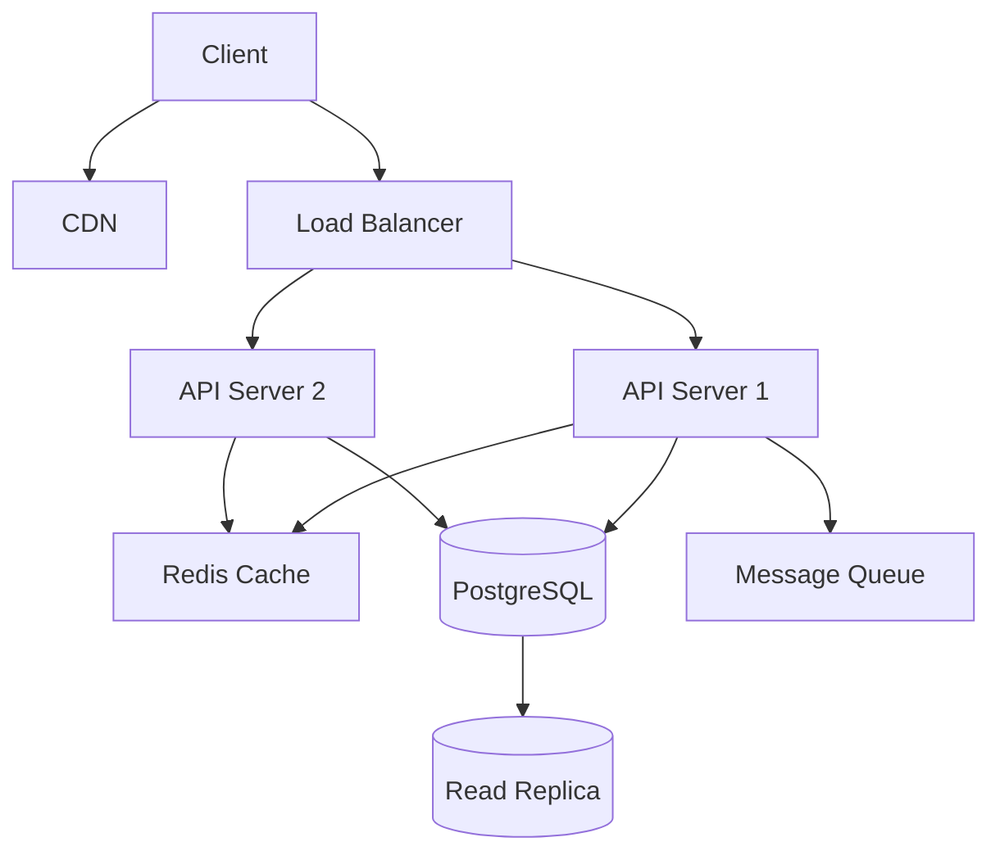

# Architecture Design Skill

**Expert patterns for backend system architecture, ADRs, and scalability planning**

## Core Principles

1. **Start Simple**: Begin with monolith, evolve to microservices only when needed
2. **Design for Failure**: Assume everything will fail eventually
3. **Document Decisions**: Every significant choice needs an ADR
4. **Measure Everything**: Can't optimize what you don't measure
5. **Security First**: Build security in, not bolt it on later

---

## Architecture Decision Records (ADRs)

### ADR Template

Use this exact structure for all ADRs:

```markdown
# ADR-NNN: [Short Title]

**Date**: YYYY-MM-DD
**Status**: Proposed | Accepted | Deprecated | Superseded by ADR-XXX
**Deciders**: [Names or roles]
**Technical Story**: [Issue/ticket reference]

## Context and Problem Statement

[Describe the context and problem in 2-3 paragraphs.
What forces are at play? What constraints exist?]

## Decision Drivers

* [Driver 1 - e.g., "Need to support 10K concurrent users"]
* [Driver 2 - e.g., "Team has Python expertise"]
* [Driver 3 - e.g., "Budget constraint of $500/month"]
* [Driver 4 - e.g., "Must deploy within 3 months"]

## Considered Options

* [Option 1]
* [Option 2]
* [Option 3]

## Decision Outcome

Chosen option: "[Option X]", because [justification in 1-2 sentences].

### Positive Consequences

* [Consequence 1]
* [Consequence 2]
* [Consequence 3]

### Negative Consequences

* [Consequence 1]
* [Consequence 2]
* [Risk mitigation for each negative]

## Pros and Cons of the Options

### [Option 1]

* ✅ Good, because [argument 1]
* ✅ Good, because [argument 2]
* ❌ Bad, because [argument 3]
* ❌ Bad, because [argument 4]

### [Option 2]

* ✅ Good, because [argument 1]
* ❌ Bad, because [argument 2]

### [Option 3]

* ✅ Good, because [argument 1]
* ❌ Bad, because [argument 2]

## Links

* [Reference 1]
* [Benchmark data]
* [Related ADRs]
```

### ADR Numbering

```
ADR-001: Use PostgreSQL for primary database
ADR-002: Adopt microservices architecture
ADR-003: Choose FastAPI for API framework
ADR-004: Use Redis for caching
ADR-005: Implement event-driven architecture with Kafka
```

Pad with zeros for sorting (001, 002, etc.)

### Common ADR Topics

- Database selection
- Architecture pattern (monolith vs microservices)
- API framework choice
- Authentication/authorization approach
- Deployment strategy
- Caching strategy
- Message queue selection
- Search engine choice
- Monitoring solution

---

## Architecture Patterns

### Pattern 1: Monolithic Architecture

**When to use**:
- Small team (< 5 developers)
- Simple domain
- MVP/prototype
- Limited traffic (< 1000 users)

**Structure**:
```
monolith/
├── api/           # HTTP endpoints
├── services/      # Business logic
├── models/        # Data models
├── database/      # Schema, migrations
└── config/        # Configuration
```

**Pros**:
- Simple deployment
- Easy testing
- No network latency between components
- Easier debugging

**Cons**:
- Scaling entire app (can't scale components independently)
- Long build/deploy times as it grows
- Technology lock-in

### Pattern 2: Microservices Architecture

**When to use**:
- Large team (10+ developers)
- Complex domain with clear boundaries
- Need independent scaling
- Different tech stacks for different components

**Structure**:
```
services/
├── user-service/
│   ├── api/
│   ├── database/
│   └── Dockerfile
├── order-service/
│   ├── api/
│   ├── database/
│   └── Dockerfile
├── notification-service/
└── api-gateway/
```

**Pros**:
- Independent deployment
- Technology flexibility
- Team autonomy
- Fault isolation

**Cons**:
- Operational complexity
- Network latency
- Data consistency challenges
- Debugging distributed systems

**Best Practice**: Start monolithic, extract services when pain points arise

### Pattern 3: Event-Driven Architecture

**When to use**:
- Async processing needed
- Decoupled systems
- Real-time updates
- Audit trail required

**Components**:
- **Producers**: Emit events
- **Message Broker**: Kafka, RabbitMQ, SQS
- **Consumers**: Process events
- **Event Store**: Persist events

**Example**:
```
User registers → UserCreated event
  → Send welcome email (consumer 1)
  → Create analytics profile (consumer 2)
  → Notify admin (consumer 3)
```

**Pros**:
- Loose coupling
- Scalability
- Fault tolerance
- Historical replay

**Cons**:
- Eventual consistency
- Debugging complexity
- Message ordering challenges

### Pattern 4: CQRS (Command Query Responsibility Segregation)

**When to use**:
- Complex read requirements
- Read/write ratio imbalance (>10:1)
- Different scaling needs for reads vs writes

**Structure**:
- **Command Side**: Handles writes, enforces business rules
- **Query Side**: Optimized read models, possibly denormalized
- **Event Store**: Syncs command to query side

**Pros**:
- Optimized read/write models
- Independent scaling
- Simplified queries

**Cons**:
- Eventual consistency
- Increased complexity
- Data synchronization

### Pattern 5: Layered Architecture

**Layers**:
1. **Presentation Layer**: API, UI
2. **Business Logic Layer**: Services, domain logic
3. **Data Access Layer**: Repositories, ORM
4. **Database Layer**: Actual database

**Rules**:
- Each layer only communicates with layer below
- Clear separation of concerns
- Easy to test each layer

**Example**:
```
API Layer (FastAPI)
     ↓
Service Layer (Business Logic)
     ↓
Repository Layer (Data Access)
     ↓
Database (PostgreSQL)
```

---

## Scalability Patterns

### Vertical Scaling (Scale Up)

**Approach**: Increase resources of existing servers

**When to use**:
- Stateful applications (databases)
- Single-threaded bottlenecks
- Quick fix before horizontal scaling

**Limits**:
- Hardware maximums (256 GB RAM, 96 cores, etc.)
- Expensive at high end
- Single point of failure

### Horizontal Scaling (Scale Out)

**Approach**: Add more servers

**Requirements**:
- Stateless application design
- Load balancer for distribution
- Shared state (database, cache)

**Implementation**:
```
Load Balancer
    ↓
┌────┴────┬────────┬────────┐
│ App 1   │ App 2  │ App 3  │
└─────────┴────────┴────────┘
         ↓
   Shared Database
```

**Best Practices**:
- Session stored in Redis (not in-memory)
- Stateless HTTP endpoints
- Auto-scaling based on metrics

### Database Scaling

**Read Scaling**:
- **Read Replicas**: Route reads to replicas
- **Caching**: Redis for frequently accessed data
- **CDN**: For static content

**Write Scaling**:
- **Sharding**: Partition data across databases
- **Connection Pooling**: Reuse database connections
- **Batch Writes**: Group small writes

**Sharding Strategies**:
- **Hash-based**: `user_id % num_shards`
- **Range-based**: Users 1-1M shard 1, 1M-2M shard 2
- **Geographic**: US users → US shard, EU users → EU shard

### Caching Strategies

**Cache-Aside** (Lazy Loading):
```python
def get_user(user_id):
    # Check cache first
    user = cache.get(f"user:{user_id}")
    if user:
        return user

    # Cache miss, load from DB
    user = db.query(User).get(user_id)

    # Store in cache
    cache.set(f"user:{user_id}", user, ttl=3600)
    return user
```

**Write-Through**:
```python
def update_user(user_id, data):
    # Update database
    user = db.query(User).get(user_id)
    user.update(data)
    db.commit()

    # Update cache
    cache.set(f"user:{user_id}", user, ttl=3600)
```

**Cache Invalidation**:
```python
def delete_user(user_id):
    # Delete from database
    db.query(User).filter_by(id=user_id).delete()
    db.commit()

    # Invalidate cache
    cache.delete(f"user:{user_id}")
```

**Cache Eviction Policies**:
- **LRU** (Least Recently Used): Most common
- **LFU** (Least Frequently Used): For access patterns
- **TTL** (Time To Live): Expire after duration

---

## Technology Stack Selection

### Selection Criteria Matrix

| Criterion | Weight | Scoring |
|-----------|--------|---------|
| Team Expertise | 25% | 1-5 scale |
| Performance | 20% | Benchmarks |
| Community Support | 15% | GitHub stars, StackOverflow |
| Cost | 15% | Licensing + infrastructure |
| Maturity | 10% | Years in production |
| Ecosystem | 10% | Libraries, tools |
| Learning Curve | 5% | Time to productivity |

### Common Stack Recommendations

**Python Stack** (AI/ML, Data-Heavy):
- Framework: FastAPI / Django
- Database: PostgreSQL
- Cache: Redis
- Queue: Celery + Redis
- Deployment: Docker, Kubernetes

**Node.js Stack** (Real-time, I/O-Heavy):
- Framework: Express / NestJS
- Database: PostgreSQL / MongoDB
- Cache: Redis
- Queue: Bull / RabbitMQ
- Deployment: PM2, Docker

**Go Stack** (High Performance, Microservices):
- Framework: Gin / Echo
- Database: PostgreSQL
- Cache: Redis
- Queue: NATS / Kafka
- Deployment: Docker, Kubernetes

**Java Stack** (Enterprise, Large Scale):
- Framework: Spring Boot
- Database: PostgreSQL / Oracle
- Cache: Redis / Hazelcast
- Queue: Kafka / RabbitMQ
- Deployment: Kubernetes

### Database Selection

**PostgreSQL** (default choice):
- Pros: ACID, powerful queries, JSON support, extensions
- Cons: Write scaling requires sharding
- Use when: Relational data, complex queries

**MySQL**:
- Pros: Simple, fast reads, wide adoption
- Cons: Less feature-rich than PostgreSQL
- Use when: Read-heavy, simple schema

**MongoDB**:
- Pros: Flexible schema, horizontal scaling
- Cons: No joins, eventual consistency
- Use when: Document storage, rapid iteration

**Redis**:
- Pros: In-memory speed, data structures
- Cons: Limited by RAM
- Use when: Caching, sessions, real-time

**Cassandra**:
- Pros: Write throughput, multi-datacenter
- Cons: Eventual consistency, limited queries
- Use when: Time-series, high write volume

---

## System Design Process

### Step 1: Requirements Gathering

**Functional Requirements**:
- What features?
- What user actions?
- What outputs?

**Non-Functional Requirements**:
- **Performance**: Latency, throughput
- **Scalability**: Expected load, growth
- **Availability**: Uptime SLA (99%, 99.9%, 99.99%)
- **Consistency**: Strong vs eventual
- **Security**: Authentication, authorization, encryption

**Constraints**:
- Budget
- Timeline
- Team size/skills
- Technology restrictions

### Step 2: Capacity Estimation

**Back-of-the-envelope calculations**:

```
Example: Design Twitter

Daily Active Users (DAU): 200M
Tweets per user per day: 2
Total tweets per day: 400M
Tweets per second: 400M / 86400 ≈ 4,630 tweets/sec
Peak (3x average): ~15,000 tweets/sec

Storage:
  Tweet size: ~280 chars + metadata ≈ 500 bytes
  Daily storage: 400M * 500 bytes = 200 GB/day
  Yearly storage: 200 GB * 365 = 73 TB/year

Bandwidth:
  Write: 15K * 500 bytes = 7.5 MB/s
  Read (100x writes): 750 MB/s
```

### Step 3: High-Level Design

**Components**:
1. Client (Web, Mobile)
2. Load Balancer
3. API Servers (Stateless)
4. Application Servers
5. Cache (Redis)
6. Database (Primary + Replicas)
7. Object Storage (S3)
8. CDN
9. Message Queue
10. Analytics/Monitoring

**Draw it out** (use Mermaid):


### Step 4: Detailed Design

For each component:
- Technology choice (with ADR)
- Scaling strategy
- Failure handling
- Monitoring approach

### Step 5: Identify Bottlenecks

**Common bottlenecks**:
- Database writes
- Network bandwidth
- CPU for complex calculations
- Memory for large datasets

**Solutions**:
- Caching
- Async processing
- Sharding
- Read replicas
- CDN for static assets

---

## Security Architecture

### Defense in Depth

**Layers**:
1. **Network**: Firewall, VPC, private subnets
2. **Application**: Input validation, SQL injection prevention
3. **Authentication**: Strong passwords, MFA, JWT
4. **Authorization**: RBAC, principle of least privilege
5. **Data**: Encryption at rest and in transit
6. **Monitoring**: Logging, intrusion detection

### Common Security Patterns

**Authentication**:
- JWT tokens for stateless auth
- Refresh tokens for long-lived sessions
- OAuth 2.0 for third-party auth

**Authorization**:
- Role-Based Access Control (RBAC)
- Attribute-Based Access Control (ABAC)
- Row-level security in database

**Data Protection**:
- Encrypt sensitive data at rest (AES-256)
- TLS for data in transit
- Hash passwords (bcrypt, Argon2)
- Never log secrets

---

## Monitoring and Observability

### The Three Pillars

**1. Metrics**:
- Response time (P50, P95, P99)
- Throughput (requests/sec)
- Error rate
- CPU/Memory usage

**2. Logs**:
- Structured logging (JSON)
- Centralized log aggregation
- Log levels (DEBUG, INFO, WARN, ERROR)

**3. Traces**:
- Distributed tracing
- Request flow across services
- Bottleneck identification

### SLIs, SLOs, SLAs

**SLI** (Service Level Indicator):
- What you measure
- Example: "API response time"

**SLO** (Service Level Objective):
- Target for SLI
- Example: "95% of requests < 200ms"

**SLA** (Service Level Agreement):
- Contract with users
- Example: "99.9% uptime or credit"

---

## Cost Optimization

### Strategies

**1. Right-size resources**:
- Don't over-provision
- Use auto-scaling

**2. Use spot/preemptible instances**:
- For batch jobs, non-critical workloads
- 70-90% cost savings

**3. Reserved instances**:
- 1-3 year commitments
- 30-60% savings for stable workloads

**4. Serverless for variable load**:
- Pay per execution
- Auto-scaling built-in

**5. Cache aggressively**:
- Reduce database load
- CDN for static assets

**6. Compress data**:
- Reduce storage costs
- Reduce bandwidth costs

---

## Best Practices Checklist

- [ ] Document all major decisions in ADRs
- [ ] Start with simplest architecture that meets requirements
- [ ] Plan for failure (circuit breakers, retries, fallbacks)
- [ ] Implement comprehensive monitoring from day 1
- [ ] Use feature flags for gradual rollouts
- [ ] Automate deployments (CI/CD)
- [ ] Write runbooks for common issues
- [ ] Conduct architecture reviews before implementation
- [ ] Consider cost in architecture decisions
- [ ] Design for testability
- [ ] Version all APIs
- [ ] Implement rate limiting
- [ ] Use connection pooling
- [ ] Cache at multiple levels
- [ ] Encrypt sensitive data

---

**Version**: 1.0
**Last Updated**: January 2025
**Use Cases**: System architecture design, scalability planning, technology selection
