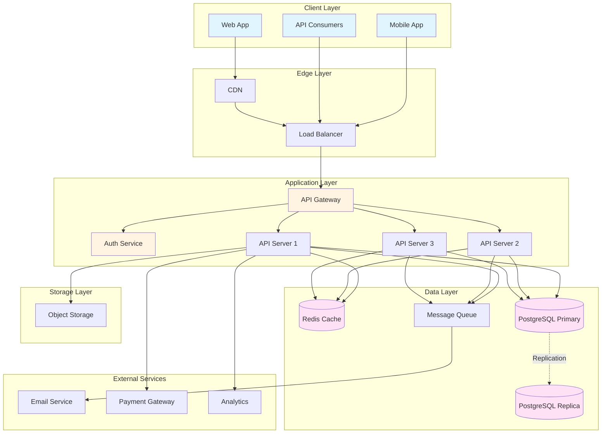
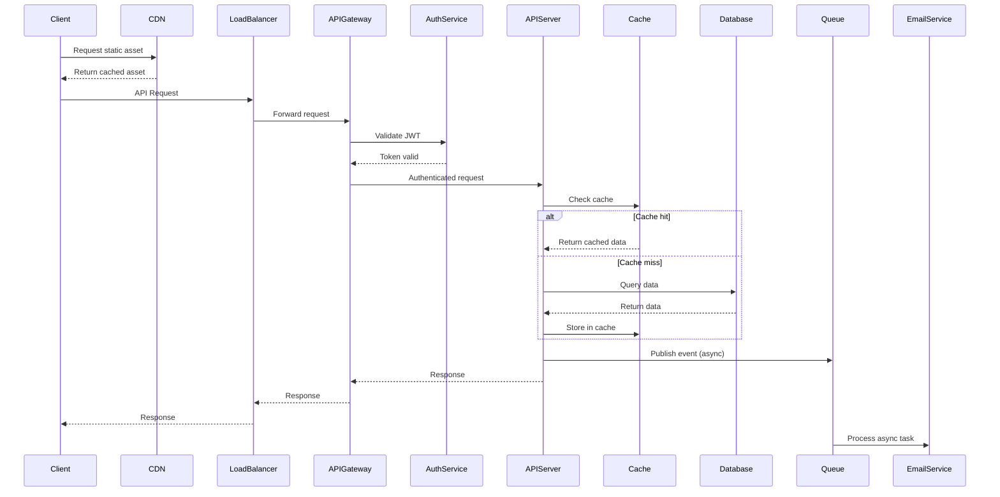
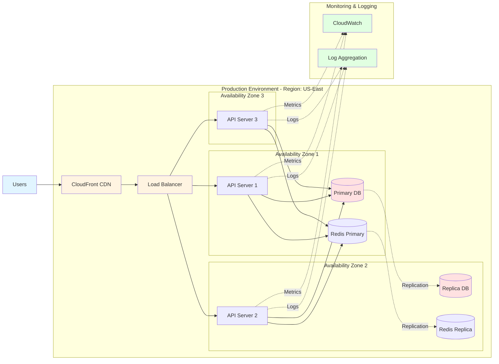
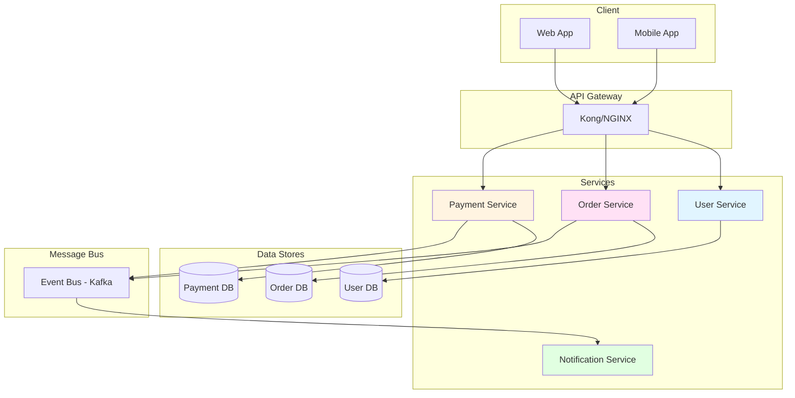
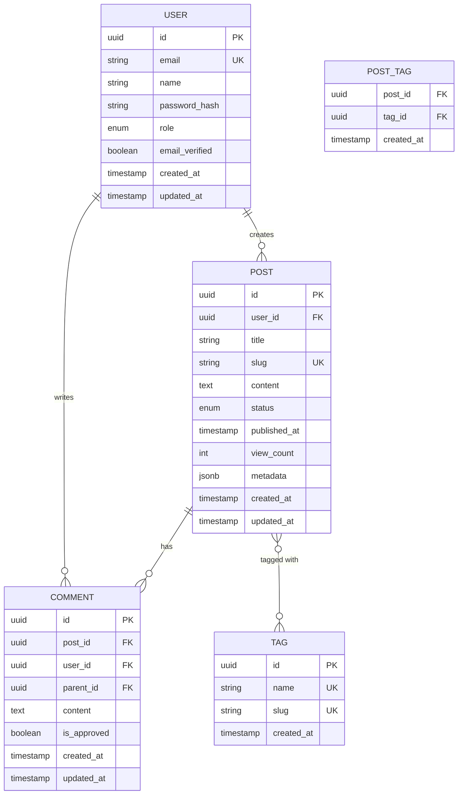
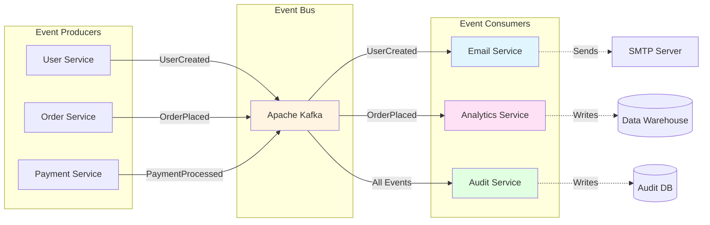

# System Architecture Diagrams

Collection of Mermaid diagrams for documenting system architecture.

## High-Level System Architecture

## Data Flow Sequence

## Deployment Architecture

## Microservices Architecture

## Database ER Diagram

## Event-Driven Architecture Flow

## CI/CD Pipeline

```mermaid
graph LR
    Dev[Developer] -->|git push| GitHub[GitHub]
    GitHub -->|webhook| CI[CI/CD - GitHub Actions]

    CI -->|1. Test| Tests[Run Tests]
    Tests -->|2. Build| Build[Build Docker Image]
    Build -->|3. Push| Registry[Container Registry]

    Registry -->|4. Deploy| Staging[Staging Environment]
    Staging -->|5. Integration Tests| StagingTests[E2E Tests]

    StagingTests -->|6. Manual Approval| Approval{Approval}
    Approval -->|Approved| Prod[Production Deploy]
    Approval -->|Rejected| Notify[Notify Team]

    Prod -->|Blue-Green Deploy| ProdServers[Production Servers]
    ProdServers -->|Health Check| Monitor[Monitoring]

    style GitHub fill:#e1f5ff
    style CI fill:#fff4e1
    style Staging fill:#ffe1f5
    style Prod fill:#e1ffe1
    style Approval fill:#ffcccc
```

## Notes

- Customize these diagrams based on your specific architecture
- Update regularly as system evolves
- Include in architecture documentation
- Use for onboarding new team members
- Reference in ADRs and design docs
