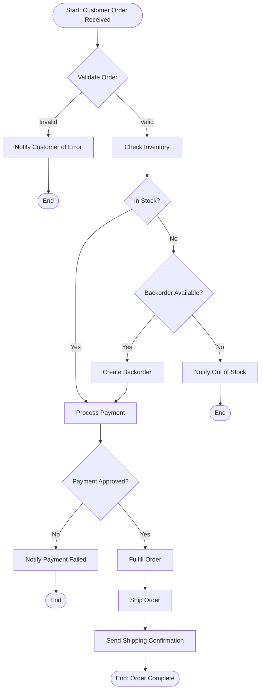

# Business Analysis Skill

Comprehensive guide for business analysis practices, requirements gathering, process modeling, and analysis techniques.

**Version**: 1.0.0
**Last Updated**: 2025-10-30
**Target Audience**: Business Analysts, Requirements Engineers, Process Analysts

---

## Table of Contents

1. [Requirements Gathering](#1-requirements-gathering)
2. [Process Modeling](#2-process-modeling)
3. [Requirements Documentation](#3-requirements-documentation)
4. [Analysis Techniques](#4-analysis-techniques)
5. [Tools & Deliverables](#5-tools--deliverables)

---

## 1. Requirements Gathering

Requirements gathering is the foundation of successful business analysis. This section covers techniques for eliciting, discovering, and understanding stakeholder needs.

### 1.1 Stakeholder Identification and Analysis

#### Identifying Stakeholders

**Definition**: Stakeholders are individuals or groups who can affect or be affected by the project.

**Stakeholder Categories**:

1. **Primary Stakeholders** (directly affected):
   - End users
   - Customers
   - Project sponsors
   - Product owners

2. **Secondary Stakeholders** (indirectly affected):
   - Support teams
   - Training staff
   - Compliance officers
   - Vendors/suppliers

3. **Key Influencers**:
   - Executive leadership
   - Department heads
   - Subject matter experts (SMEs)
   - Change agents

**Stakeholder Identification Techniques**:

```markdown
## Brainstorming Session
- Gather project team
- List all potential stakeholders
- Group by category and influence level
- Validate with project sponsor

## Organizational Chart Analysis
- Review org structure
- Identify impacted departments
- Map reporting relationships
- Identify decision makers

## Previous Project Analysis
- Review similar past projects
- Identify who was involved
- Learn from previous stakeholder engagement
```

#### Stakeholder Analysis Matrix

Create a Power/Interest Grid to prioritize stakeholder engagement:

```markdown
| Stakeholder | Power | Interest | Strategy |
|-------------|-------|----------|----------|
| CEO | High | Low | Keep Satisfied |
| End Users | Low | High | Keep Informed |
| Project Sponsor | High | High | Manage Closely |
| IT Support | Medium | Medium | Keep Informed |
```

**Power/Interest Grid Quadrants**:

1. **High Power, High Interest** (Manage Closely):
   - Key players, engage frequently
   - Involve in decision-making
   - Regular status updates
   - Address concerns promptly

2. **High Power, Low Interest** (Keep Satisfied):
   - Keep informed at high level
   - Don't overwhelm with details
   - Seek approval at key milestones
   - Monitor for changing interest

3. **Low Power, High Interest** (Keep Informed):
   - Regular communication
   - Gather detailed feedback
   - Champions for change
   - Can provide valuable insights

4. **Low Power, Low Interest** (Monitor):
   - Minimal effort
   - General updates sufficient
   - Monitor for changes
   - May become more engaged later

#### Stakeholder Analysis Template

```markdown
## Stakeholder Profile: [Name/Group]

**Role**: [Job title or group description]
**Department**: [Organizational unit]
**Level**: [Executive/Management/Staff]

**Power/Influence**: [High/Medium/Low]
**Interest Level**: [High/Medium/Low]
**Engagement Strategy**: [Manage Closely/Keep Satisfied/Keep Informed/Monitor]

**Needs and Expectations**:
- [What they need from the project]
- [What they expect as outcomes]
- [Success criteria from their perspective]

**Potential Concerns**:
- [What might worry them]
- [Resistance points]
- [Risk areas]

**Communication Preferences**:
- **Frequency**: [Daily/Weekly/Monthly]
- **Method**: [Email/Meetings/Reports/Dashboard]
- **Detail Level**: [High-level summary/Detailed analysis]

**Key Questions for This Stakeholder**:
1. [Question about their needs]
2. [Question about their constraints]
3. [Question about success criteria]
```

### 1.2 Interview Techniques and Questions

#### Interview Preparation

**Before the Interview**:

1. **Research the stakeholder**:
   - Review their role and responsibilities
   - Understand their department's goals
   - Identify previous interactions with similar projects

2. **Prepare questions**:
   - Create structured interview guide
   - Mix open and closed questions
   - Prepare follow-up probes

3. **Set expectations**:
   - Send agenda in advance
   - Clarify purpose and duration
   - Request any pre-reading materials

4. **Logistics**:
   - Book appropriate time (usually 60-90 minutes)
   - Choose comfortable, private location
   - Test recording equipment (with permission)
   - Prepare note-taking tools

#### Interview Question Framework

**Opening Questions** (Build rapport):
- "Can you describe your current role and key responsibilities?"
- "How long have you been with the organization?"
- "What does a typical day look like for you?"

**Current State Questions**:
- "Can you walk me through your current process for [activity]?"
- "What tools or systems do you currently use?"
- "How do you measure success in your current workflow?"
- "What works well in the current process?"

**Pain Points and Challenges**:
- "What are the biggest challenges you face daily?"
- "What frustrates you most about the current system/process?"
- "Where do you spend the most time in your work?"
- "What causes delays or rework?"
- "If you could change one thing, what would it be?"

**Future State and Requirements**:
- "What would the ideal solution look like?"
- "How would success be measured in a new system?"
- "What capabilities are absolutely essential?"
- "What would make your job significantly easier?"
- "How do you envision using this new system/process?"

**Constraint Questions**:
- "Are there regulatory or compliance requirements we must meet?"
- "What is your timeline for needing this solution?"
- "Are there budget constraints we should be aware of?"
- "What technical limitations do we need to consider?"

**Priority Questions**:
- "If we can only deliver three features, which would you choose?"
- "What capabilities are must-haves vs. nice-to-haves?"
- "What would you be willing to trade off?"

**Closing Questions**:
- "Who else should I speak with about this?"
- "Is there anything important I haven't asked about?"
- "May I follow up if I have additional questions?"

#### Interview Techniques

**Active Listening**:
```markdown
DO:
- Maintain eye contact
- Nod and show engagement
- Take notes but don't let it distract
- Paraphrase to confirm understanding
- Ask clarifying questions

DON'T:
- Interrupt or finish sentences
- Jump to solutions
- Make assumptions
- Multi-task or check devices
- Show bias or judgment
```

**Probing Techniques**:

1. **The 5 Whys**:
   ```
   "We need faster reporting."
   Why? "Reports take too long to generate."
   Why? "We have to pull data from multiple systems."
   Why? "Systems aren't integrated."
   Why? "We lack an enterprise data warehouse."
   Why? "Previous integration project was never completed."
   ```

2. **Expanding Questions**:
   - "Can you tell me more about that?"
   - "What do you mean by [term]?"
   - "Can you give me an example?"
   - "What happens next in that scenario?"

3. **Clarifying Questions**:
   - "When you say 'fast', what timeframe are you thinking?"
   - "Who specifically is included in 'the team'?"
   - "What would 'improved' look like in measurable terms?"

4. **Hypothetical Questions**:
   - "If you had unlimited resources, what would you build?"
   - "What if we could automate this entire process?"
   - "Imagine it's a year from now and this is successful - what changed?"

#### Interview Documentation

**During Interview**:
- Note key quotes verbatim
- Mark action items with [ACTION]
- Flag inconsistencies with [?]
- Track follow-up questions with [FOLLOW-UP]

**Post-Interview**:
```markdown
## Interview Summary: [Stakeholder Name]
**Date**: [Date]
**Duration**: [Time]
**Location**: [Location/Remote]
**Attendees**: [Names and roles]

### Key Takeaways
- [Main point 1]
- [Main point 2]
- [Main point 3]

### Current State Observations
[Summary of how things work now]

### Pain Points Identified
1. [Pain point 1 - with specific examples]
2. [Pain point 2 - with specific examples]
3. [Pain point 3 - with specific examples]

### Requirements Identified
| Requirement | Priority | Type |
|-------------|----------|------|
| [Requirement description] | Must-Have | Functional |
| [Requirement description] | Should-Have | Non-Functional |

### Action Items
- [ ] [Follow-up action 1]
- [ ] [Follow-up action 2]

### Follow-up Questions
- [Question that emerged during interview]
- [Clarification needed]

### Additional Stakeholders to Contact
- [Name] - [Reason to contact]

### Quotes
> "[Significant quote that captures key insight]"
> - [Stakeholder name]
```

### 1.3 Workshop Facilitation

Workshops bring multiple stakeholders together for collaborative requirements elicitation.

#### Workshop Types

**1. Requirements Workshop**:
- **Purpose**: Gather and validate requirements
- **Duration**: 2-4 hours
- **Participants**: 6-12 key stakeholders
- **Outcome**: Prioritized requirements list

**2. Process Mapping Workshop**:
- **Purpose**: Document current or future processes
- **Duration**: 3-6 hours
- **Participants**: Process owners and participants
- **Outcome**: Visual process maps

**3. Design Thinking Workshop**:
- **Purpose**: Ideate solutions collaboratively
- **Duration**: 1-2 days
- **Participants**: Cross-functional team
- **Outcome**: Prototype concepts

**4. Prioritization Workshop**:
- **Purpose**: Rank requirements or features
- **Duration**: 2-3 hours
- **Participants**: Decision makers and SMEs
- **Outcome**: Ranked backlog

#### Workshop Planning Checklist

**4-6 Weeks Before**:
- [ ] Define workshop objectives and scope
- [ ] Identify and invite participants
- [ ] Book facility and arrange logistics
- [ ] Identify co-facilitator if needed

**2-4 Weeks Before**:
- [ ] Develop detailed agenda
- [ ] Prepare workshop materials
- [ ] Send pre-work to participants
- [ ] Confirm attendance

**1 Week Before**:
- [ ] Send reminder with logistics
- [ ] Finalize materials and print
- [ ] Test technology (projector, video conferencing)
- [ ] Arrange catering if applicable

**Day Before**:
- [ ] Review agenda and materials
- [ ] Prepare room setup diagram
- [ ] Charge devices
- [ ] Print name tents

**Day Of**:
- [ ] Arrive early to set up room
- [ ] Test all equipment
- [ ] Arrange materials
- [ ] Welcome participants

#### Workshop Agenda Template

```markdown
## Requirements Gathering Workshop

**Date**: [Date]
**Time**: [Start] - [End]
**Location**: [Location]
**Facilitator**: [Name]

### Pre-Work
Please review the following before the workshop:
- [Document 1]
- [Document 2]

### Agenda

**9:00 - 9:15 | Welcome and Introductions (15 min)**
- Introductions and icebreaker
- Workshop objectives
- Ground rules
- Agenda overview

**9:15 - 9:45 | Context Setting (30 min)**
- Project overview and goals
- Current state summary
- Success criteria
- Scope boundaries

**9:45 - 10:30 | Requirements Brainstorming (45 min)**
Activity: Silent brainstorming followed by group sharing
- Functional requirements
- Non-functional requirements
- Constraints

**10:30 - 10:45 | Break (15 min)**

**10:45 - 11:30 | Requirements Refinement (45 min)**
Activity: Group discussion and clustering
- Consolidate similar items
- Clarify ambiguous requirements
- Add missing details

**11:30 - 12:15 | Prioritization (45 min)**
Activity: MoSCoW prioritization
- Must Have
- Should Have
- Could Have
- Won't Have (this time)

**12:15 - 12:30 | Wrap-up and Next Steps (15 min)**
- Summary of outcomes
- Action items
- Next steps
- Feedback

### Ground Rules
- One conversation at a time
- All ideas are valid
- Stay focused on objectives
- Be present (minimize devices)
- Respect time boundaries
- Challenge ideas, not people
```

#### Facilitation Techniques

**Brainstorming Rules**:
```markdown
1. Quantity over quality initially
2. No criticism or evaluation during generation
3. Wild ideas encouraged
4. Build on others' ideas
5. Stay focused on topic
6. One conversation at a time
```

**Dot Voting for Prioritization**:
```markdown
1. List all items on wall/board
2. Give each participant 5-7 dot stickers
3. Participants place dots on top priorities
4. Can use multiple dots on one item (if allowed)
5. Count dots to see top priorities
6. Discuss results and make final decisions
```

**MoSCoW Prioritization**:
```markdown
**Must Have**: Critical for go-live, project fails without
**Should Have**: Important but not critical, can be deferred
**Could Have**: Nice to have, include if time/budget allows
**Won't Have**: Out of scope for this release
```

**Affinity Mapping**:
```markdown
1. Write each idea on separate sticky note
2. Post all notes on wall
3. Silently group similar items together
4. Discuss groupings as a team
5. Name each group
6. Identify themes and patterns
```

#### Managing Difficult Situations

**Dominant Participant**:
- "Thank you [Name], let's hear from others"
- Use round-robin approach
- Direct questions to quieter participants
- Use silent brainstorming techniques

**Off-Topic Discussion**:
- "That's important, let's capture it in the parking lot"
- "How does this relate to our objective?"
- Redirect to agenda
- Use parking lot board for tangents

**Disagreement or Conflict**:
- Acknowledge both perspectives
- Focus on interests, not positions
- Find common ground
- Table for offline discussion if needed
- Use voting to resolve deadlock

**Low Energy**:
- Take an unscheduled break
- Use energizer activity
- Change format (stand up, move around)
- Check if agenda is too ambitious

### 1.4 Observation and Job Shadowing

Observation provides firsthand insight into how work actually happens (vs. how stakeholders describe it).

#### When to Use Observation

**Ideal Scenarios**:
- Complex processes difficult to describe
- Significant muscle memory or tacit knowledge
- Suspected gaps between described and actual process
- Understanding context and environment
- Identifying workarounds and informal processes

**Not Appropriate When**:
- Highly sensitive or confidential work
- Process happens infrequently
- Work is dangerous or restricted
- Stakeholder is uncomfortable being observed

#### Planning an Observation Session

**Preparation**:
```markdown
1. **Get Permission**:
   - Manager approval
   - Individual consent
   - Explain purpose and process

2. **Set Expectations**:
   - Duration of observation
   - Your role (observer, not evaluator)
   - Confidentiality of findings
   - Ability to ask questions

3. **Prepare Tools**:
   - Observation checklist
   - Note-taking materials
   - Camera (if permitted)
   - Process documentation template

4. **Choose Timing**:
   - Typical workday (avoid unusual circumstances)
   - Complete process cycle if possible
   - Consider busy vs. slow periods
```

#### Observation Framework

**What to Observe**:

1. **Physical Environment**:
   - Workspace layout
   - Tools and equipment
   - Materials and supplies
   - Ergonomics and comfort

2. **Process Steps**:
   - Sequence of activities
   - Decision points
   - Handoffs between people/systems
   - Inputs and outputs

3. **Time and Effort**:
   - Duration of each step
   - Wait times and delays
   - Multitasking
   - Rush vs. thorough work

4. **Tools and Systems**:
   - Software applications used
   - Manual vs. automated steps
   - System switching
   - Workarounds and shortcuts

5. **Interactions**:
   - Communication patterns
   - Collaboration needs
   - Questions asked
   - Information sources

6. **Pain Points**:
   - Frustrations expressed
   - Errors or rework
   - Confusion or uncertainty
   - Inefficiencies

#### Observation Template

```markdown
## Job Shadowing Session: [Role/Process]

**Date**: [Date]
**Time**: [Start] - [End]
**Observer**: [Your name]
**Participant**: [Role or anonymous identifier]
**Process Observed**: [Process name]

### Environment Notes
[Physical workspace, tools available, noise level, etc.]

### Process Flow Observed

| Time | Step | Activity Description | Tools Used | Duration | Notes |
|------|------|---------------------|------------|----------|-------|
| 9:00 | 1 | Login to system | System X | 2 min | Had to reset password |
| 9:02 | 2 | Pull overnight orders | System X | 5 min | System slow to respond |
| 9:07 | 3 | Export to Excel | System X, Excel | 3 min | Manual export needed |

### Workarounds Identified
1. [Workaround description and why it exists]
2. [Workaround description and why it exists]

### Pain Points Observed
- **[Pain point]**: [Description and impact]
- **[Pain point]**: [Description and impact]

### Automation Opportunities
- [Step that could be automated]
- [Repetitive task that could be streamlined]

### Questions Raised
- [Question about why process is done this way]
- [Question about alternative approaches]

### Process Improvement Ideas
1. [Improvement idea based on observation]
2. [Improvement idea based on observation]

### Follow-up Actions
- [ ] Validate observations with participant
- [ ] Interview [Name] about related process
- [ ] Research system capability for [specific need]
```

#### Think-Aloud Protocol

Ask participant to verbalize their thinking:

```markdown
"As you work, please describe what you're thinking and doing:
- What you're looking at
- What you're deciding
- Why you're choosing one option over another
- What you're concerned about"
```

**Benefits**:
- Reveals decision-making process
- Uncovers tacit knowledge
- Identifies information needs
- Shows workarounds and informal rules

### 1.5 Document Analysis

Existing documentation provides valuable context and baseline information.

#### Types of Documents to Analyze

**Strategic Documents**:
- Business plans
- Strategic roadmaps
- Vision and mission statements
- Goals and objectives

**Operational Documents**:
- Standard operating procedures (SOPs)
- Work instructions
- Training materials
- Quality checklists

**System Documentation**:
- User manuals
- System specifications
- Database schemas
- Integration diagrams

**Historical Records**:
- Previous project documentation
- Lessons learned reports
- Meeting minutes
- Email threads

**Compliance Documents**:
- Regulatory requirements
- Audit reports
- Policy documents
- Contracts and SLAs

**Performance Data**:
- Reports and dashboards
- Metrics and KPIs
- Incident logs
- Customer feedback

#### Document Analysis Framework

```markdown
## Document Analysis: [Document Name]

**Document Type**: [Type]
**Date Created**: [Date]
**Author**: [Name/Department]
**Last Updated**: [Date]
**Purpose**: [Why document was created]

### Key Findings

**Relevant Requirements**:
- [Requirement extracted from document]
- [Requirement extracted from document]

**Business Rules Identified**:
- [Rule 1]
- [Rule 2]

**Processes Described**:
- [Process 1 - with reference to section]
- [Process 2 - with reference to section]

**Stakeholders Mentioned**:
- [Stakeholder role and their involvement]

**Constraints Identified**:
- [Constraint from document]

**Assumptions Noted**:
- [Assumption in document]

### Gaps and Inconsistencies

**Missing Information**:
- [What's not covered that should be]

**Inconsistencies with Other Documents**:
- [Conflict with Document X about Y]

**Outdated Information**:
- [What needs updating]

### Questions for Stakeholders
1. [Question about unclear point]
2. [Question about inconsistency]
3. [Question about gap]

### Action Items
- [ ] Verify [information] with [stakeholder]
- [ ] Request updated version of [document]
- [ ] Clarify [conflicting information]
```

#### Analysis Checklist

**Quality Assessment**:
- [ ] Is documentation current and up-to-date?
- [ ] Is it complete for our needs?
- [ ] Is it accurate (verified with stakeholders)?
- [ ] Is terminology consistent?
- [ ] Are there version control issues?

**Content Analysis**:
- [ ] What requirements are explicitly stated?
- [ ] What business rules are defined?
- [ ] What processes are documented?
- [ ] What constraints are mentioned?
- [ ] What assumptions are made?

**Gap Analysis**:
- [ ] What information is missing?
- [ ] What conflicts with other documents?
- [ ] What has changed since creation?
- [ ] What needs validation?

---

## 2. Process Modeling

Process modeling creates visual representations of business processes to analyze, communicate, and improve them.

### 2.1 BPMN Notation and Diagrams

BPMN (Business Process Model and Notation) is the standard for process modeling.

#### Core BPMN Elements

**1. Events** (things that happen):

```markdown
**Start Events** (where process begins):
○ - Start Event (generic)
⊙ - Timer Start Event (scheduled)
✉ - Message Start Event (triggered by message)

**Intermediate Events** (occur during process):
◎ - Generic Intermediate Event
⊕ - Timer Intermediate Event (wait for time)
⊞ - Message Intermediate Event (send/receive message)

**End Events** (where process ends):
⊗ - End Event (process completes)
⊗ - Terminate End Event (end all paths)
✉⊗ - Message End Event (send message and end)
```

**2. Activities** (work being done):

```markdown
[Activity Name] - Task (single unit of work)
[⊞ Activity Name] - Subprocess (collapsed process)
[⊕ Activity Name] - Loop Activity (repeats)
```

**3. Gateways** (control flow):

```markdown
◇ - Exclusive Gateway (XOR) - one path chosen
⬦ - Parallel Gateway (AND) - all paths taken
⬢ - Inclusive Gateway (OR) - one or more paths
○◇ - Event-Based Gateway - wait for event
```

**4. Connecting Objects**:

```markdown
→ - Sequence Flow (order of activities)
--- → - Message Flow (between pools)
.... - Association (link to artifacts)
```

**5. Swimlanes**:

```markdown
Pool: Represents an organization or major participant
Lane: Subdivides pool by role or department
```

#### BPMN Diagram Example



#### BPMN Best Practices

**DO**:
- Start with high-level process, then detail
- Use consistent naming conventions (Verb + Noun)
- Keep diagrams readable (one page if possible)
- Show happy path clearly
- Document exceptions and error handling
- Use swimlanes to show responsibilities
- Include timing information when relevant

**DON'T**:
- Mix different levels of detail
- Create overly complex diagrams (max 20-30 elements)
- Use technical jargon for business processes
- Forget to show end states
- Ignore exception flows
- Create diagrams without validation from process owners

### 2.2 Swimlane Diagrams

Swimlanes show which role or department performs each activity.

#### Swimlane Structure

```markdown
## Order Processing (Swimlane View)

┌─────────────────────────────────────────────────────────────┐
│ CUSTOMER                                                     │
├─────────────────────────────────────────────────────────────┤
│  ○ Place Order → [Fill Order Form] → Submit →               │
│                                               ↓              │
│                                    ← [Review Confirmation]  │
└─────────────────────────────────────────────────────────────┘

┌─────────────────────────────────────────────────────────────┐
│ SALES                                                        │
├─────────────────────────────────────────────────────────────┤
│                  ↑                                           │
│                [Receive Order] → {Valid?} ─No→ [Reject]     │
│                                      │                       │
│                                     Yes                      │
│                                      ↓                       │
│                              [Check Credit] → {OK?}         │
│                                      │                       │
│                                     Yes                      │
│                                      ↓                       │
└─────────────────────────────────────────────────────────────┘

┌─────────────────────────────────────────────────────────────┐
│ WAREHOUSE                                                    │
├─────────────────────────────────────────────────────────────┤
│                                      ↑                       │
│                           [Pick Items] → [Pack Order]       │
│                                              ↓               │
└─────────────────────────────────────────────────────────────┘

┌─────────────────────────────────────────────────────────────┐
│ SHIPPING                                                     │
├─────────────────────────────────────────────────────────────┤
│                                              ↑               │
│                              [Create Label] → [Ship] → ⊗    │
└─────────────────────────────────────────────────────────────┘
```

#### Swimlane Template

```markdown
## Process: [Process Name]

**Purpose**: [What this process accomplishes]
**Trigger**: [What starts this process]
**Outcome**: [What is produced]

### Swimlanes (Roles/Departments)

**Lane 1: [Role Name]**
- Step 1.1: [Activity]
- Step 1.2: [Activity]
- Decision 1.3: [Gateway]

**Lane 2: [Role Name]**
- Step 2.1: [Activity]
- Step 2.2: [Activity]

**Lane 3: [Role Name]**
- Step 3.1: [Activity]
- Step 3.2: [Activity]

### Handoffs

| From | To | What is Transferred | Method | Time |
|------|-----|---------------------|--------|------|
| Sales | Warehouse | Order details | System X | Real-time |
| Warehouse | Shipping | Packed order | Physical handoff | 15 min |

### Notes
- [Important information about process]
- [Exceptions or special cases]
```

### 2.3 Process Analysis (As-Is vs To-Be)

#### As-Is Process Analysis

**Purpose**: Document current state to identify improvement opportunities.

**As-Is Analysis Template**:

```markdown
## As-Is Process: [Process Name]

**Last Updated**: [Date]
**Process Owner**: [Name]
**Frequency**: [How often process runs]
**Average Duration**: [Time to complete]

### Process Overview
[Brief description of what process does today]

### Process Steps

| Step | Activity | Role | System | Duration | Issues |
|------|----------|------|--------|----------|--------|
| 1 | Receive request | Admin | Email | 5 min | Manual entry required |
| 2 | Validate data | Analyst | Excel | 30 min | No validation rules |
| 3 | Approve request | Manager | Paper form | 2 days | Manager often unavailable |

### Process Metrics

**Efficiency Metrics**:
- Total cycle time: 3-5 days
- Active work time: 2 hours
- Wait time: 90% of cycle time
- Rework rate: 20%
- Error rate: 15%

**Volume Metrics**:
- Requests per month: 200
- Peak volume: 350 (month-end)
- Staff required: 3 FTEs

**Cost Metrics**:
- Labor cost per transaction: $45
- System costs: $500/month
- Error correction cost: $2,000/month

### Pain Points Identified

**1. Manual Data Entry**
- **Issue**: Request form must be re-typed into system
- **Impact**: Time consuming, error-prone
- **Frequency**: Every request
- **Impact Score**: High

**2. Approval Delays**
- **Issue**: Manager approval requires physical signature
- **Impact**: 2-3 day delays common, longer if manager traveling
- **Frequency**: Every request
- **Impact Score**: High

**3. No Validation**
- **Issue**: Data errors discovered late in process
- **Impact**: Rework and delays
- **Frequency**: 20% of requests
- **Impact Score**: Medium

### Bottlenecks
1. Manager approval (48-72 hour delay)
2. Data validation (30 minutes of manual checking)
3. Month-end volume spike (causes 5-day backlog)

### Workarounds
- Analysts email manager for urgent approvals
- Pre-validation by submitter (informal)
- Overtime during month-end

### Root Causes
- Legacy systems not integrated
- Manual approval policy never updated
- No investment in automation tools
```

#### To-Be Process Design

**Purpose**: Define future state that addresses pain points.

**To-Be Design Template**:

```markdown
## To-Be Process: [Process Name]

**Target Implementation**: [Date]
**Process Owner**: [Name]
**Expected Frequency**: [How often]
**Target Duration**: [Time to complete]

### Process Overview
[Description of improved process]

### Improvements Over As-Is

| Current State | Future State | Improvement |
|---------------|--------------|-------------|
| Manual data entry | Web form with integration | 80% time reduction |
| Physical signature | Electronic approval | 90% faster approval |
| Manual validation | Automated rules | 100% error detection |

### Process Steps (To-Be)

| Step | Activity | Role | System | Duration | Changes from As-Is |
|------|----------|------|--------|----------|-------------------|
| 1 | Submit request | Requester | Web portal | 2 min | Self-service, validation |
| 2 | Auto-validate | System | Portal | 30 sec | Automated |
| 3 | Approve request | Manager | Portal (mobile) | 1 hour | Electronic, notifications |

### Expected Metrics

**Efficiency Improvements**:
- Total cycle time: 4 hours (was 3-5 days)
- Active work time: 30 minutes (was 2 hours)
- Wait time: 10% (was 90%)
- Rework rate: 2% (was 20%)
- Error rate: 1% (was 15%)

**Capacity Improvements**:
- Staff required: 1 FTE (was 3)
- Peak handling: 500/month (was 350)
- No overtime needed

**Cost Savings**:
- Labor cost per transaction: $8 (was $45)
- Annual labor savings: $88,800
- Error correction savings: $21,600/year
- ROI: 18 months

### Changes Required

**Technology**:
- [ ] Implement web portal
- [ ] Integrate with core system
- [ ] Build validation rules
- [ ] Enable electronic signatures
- [ ] Mobile app for managers

**Process**:
- [ ] Update approval policy
- [ ] Create self-service help
- [ ] Define SLAs
- [ ] Update training materials

**People**:
- [ ] Train requesters on portal
- [ ] Train managers on mobile approval
- [ ] Redeploy 2 FTEs to other work

**Governance**:
- [ ] Update policy documents
- [ ] Get executive approval
- [ ] Communicate changes
- [ ] Establish metrics dashboard

### Implementation Plan

**Phase 1: Foundation (Month 1-2)**
- Build web portal
- Integrate systems
- Pilot with small group

**Phase 2: Rollout (Month 3)**
- Train all users
- Full launch
- Monitor closely

**Phase 3: Optimize (Month 4-6)**
- Gather feedback
- Fine-tune process
- Measure benefits

### Risk Mitigation

| Risk | Probability | Impact | Mitigation |
|------|-------------|--------|------------|
| User adoption | Medium | High | Extensive training, champions |
| System integration | Low | High | Prototype early, fallback plan |
| Process not followed | Medium | Medium | Clear communication, monitoring |
```

### 2.4 Process Improvement Identification

#### Process Improvement Framework

**DMAIC Methodology** (Six Sigma approach):

```markdown
**Define**: What process needs improvement?
- Identify process scope
- Define problem statement
- Establish goals and metrics

**Measure**: How is the process performing?
- Map current process
- Collect baseline data
- Identify pain points

**Analyze**: Why are problems occurring?
- Root cause analysis
- Identify waste and inefficiency
- Determine improvement opportunities

**Improve**: What changes will help?
- Design future state
- Pilot improvements
- Validate benefits

**Control**: How do we sustain improvements?
- Implement monitoring
- Train staff
- Document new process
```

#### Seven Wastes (LEAN)

Identify and eliminate waste in processes:

```markdown
1. **Transportation**: Unnecessary movement of materials/information
   Example: Printing document just to scan it elsewhere

2. **Inventory**: Excess information or materials waiting
   Example: Queue of 100 unprocessed requests

3. **Motion**: Unnecessary movement of people
   Example: Walking to another building for signatures

4. **Waiting**: Idle time between activities
   Example: Waiting 2 days for approval

5. **Overproduction**: Creating more than immediately needed
   Example: Generating unused reports "just in case"

6. **Overprocessing**: More work than required
   Example: Multiple people reviewing same document

7. **Defects**: Errors requiring rework
   Example: Incorrect data entry requiring correction
```

#### Improvement Identification Template

```markdown
## Process Improvement Opportunities: [Process]

### Quick Wins (High Impact, Low Effort)

**1. [Improvement Name]**
- **Current Issue**: [What's wrong]
- **Proposed Solution**: [How to fix]
- **Expected Benefit**: [What improves]
- **Effort**: [Hours/days to implement]
- **Cost**: [Estimated cost]
- **Dependencies**: [What's needed]

**2. [Improvement Name]**
[Same structure]

### Strategic Improvements (High Impact, High Effort)

**1. [Improvement Name]**
- **Current Issue**: [What's wrong]
- **Proposed Solution**: [How to fix]
- **Expected Benefit**: [What improves]
- **Effort**: [Weeks/months to implement]
- **Cost**: [Estimated cost]
- **Dependencies**: [What's needed]

### Small Enhancements (Low Impact, Low Effort)

**1. [Improvement Name]**
[Same structure]

### Not Recommended (Low Impact, High Effort)
- [Improvement that isn't worth it]

### Prioritization Matrix

```
High Impact │  3. Strategic  │  1. Quick Win
            │                │
            ├────────────────┼───────────────
            │                │
Low Impact  │  4. Not Worth  │  2. Enhancement
            │                │
            └────────────────┴───────────────
              High Effort      Low Effort
```

### Implementation Roadmap

**Q1**: Quick Wins 1, 2, 3
**Q2**: Strategic Improvement 1 (Phase 1)
**Q3**: Strategic Improvement 1 (Phase 2), Enhancement 1
**Q4**: Strategic Improvement 2
```

---

## 3. Requirements Documentation

Clear, testable requirements are the foundation of successful projects.

### 3.1 User Stories (As a, I want, So that)

User stories describe functionality from user perspective.

#### User Story Structure

```markdown
As a [type of user]
I want [goal/desire]
So that [benefit/value]
```

**Example**:
```markdown
As a customer
I want to track my order status online
So that I know when to expect delivery without calling support
```

#### Writing Good User Stories

**INVEST Criteria**:

```markdown
**I - Independent**: Story can be developed standalone
**N - Negotiable**: Details can be discussed
**V - Valuable**: Delivers value to user/business
**E - Estimable**: Team can size the effort
**S - Small**: Can be completed in one iteration
**T - Testable**: Clear acceptance criteria
```

**Examples of Good vs. Bad User Stories**:

**Bad** (Too technical):
```markdown
As a developer
I want to implement REST API endpoints
So that data can be accessed
```

**Good** (User-focused):
```markdown
As a mobile app user
I want to sync my data across devices
So that I can access my information anywhere
```

**Bad** (Too vague):
```markdown
As a user
I want better reporting
So that I can do my job
```

**Good** (Specific):
```markdown
As a sales manager
I want to see daily sales by region in a dashboard
So that I can quickly identify underperforming territories
```

#### User Story Template

```markdown
## User Story: [Short Title]

**ID**: US-###
**Epic**: [Parent epic]
**Priority**: [Must/Should/Could Have]
**Story Points**: [Estimate]

### Story

As a [role]
I want [feature]
So that [benefit]

### Acceptance Criteria

1. Given [context]
   When [action]
   Then [outcome]

2. Given [context]
   When [action]
   Then [outcome]

3. Given [context]
   When [action]
   Then [outcome]

### Additional Details

**User Persona**: [Which persona this serves]
**Business Value**: [Why this matters]
**Dependencies**: [Other stories or systems needed]
**Assumptions**: [What we're assuming]

### Technical Notes
- [Technical consideration 1]
- [Technical consideration 2]

### Questions
- [ ] [Open question to resolve]

### Definition of Done
- [ ] Code complete and reviewed
- [ ] Unit tests written and passing
- [ ] Acceptance criteria verified
- [ ] Documentation updated
- [ ] Deployed to staging
```

#### User Story Examples by Type

**Feature Story**:
```markdown
As a customer
I want to filter products by price range
So that I can find items within my budget

**Acceptance Criteria**:
1. Given I'm on the product listing page
   When I set a minimum and maximum price
   Then only products in that range are displayed

2. Given I've applied a price filter
   When no products match the range
   Then I see "No products found" message

3. Given I've applied a price filter
   When I click "Clear Filters"
   Then all products are displayed again
```

**Bug Fix Story**:
```markdown
As a user
I want the shopping cart to persist my items
So that I don't lose my selections when I close the browser

**Acceptance Criteria**:
1. Given I've added items to my cart
   When I close the browser
   Then my items are still in cart when I return

2. Given I've added items on desktop
   When I login on mobile
   Then I see the same cart items
```

**Technical Story** (when absolutely necessary):
```markdown
As a development team
We want to upgrade the database to version 12
So that we can use improved performance features

**Acceptance Criteria**:
1. Database upgraded with zero data loss
2. All existing queries still function
3. Rollback plan tested and documented
```

### 3.2 Use Cases Structure

Use cases describe interactions between actors and system to achieve a goal.

#### Use Case Template

```markdown
## Use Case: [Name]

**ID**: UC-###
**Priority**: [High/Medium/Low]
**Status**: [Draft/Reviewed/Approved]

### Brief Description
[One paragraph overview of what this use case accomplishes]

### Actors
- **Primary Actor**: [Who initiates this use case]
- **Secondary Actors**: [Other participants]
- **Systems**: [External systems involved]

### Preconditions
- [Condition that must be true before use case starts]
- [Another precondition]

### Postconditions
**Success**:
- [What's true after successful completion]
- [Another postcondition]

**Failure**:
- [What's true if use case fails]

### Main Success Scenario
1. [Actor] [action]
2. System [response]
3. [Actor] [action]
4. System [response]
5. Use case ends successfully

### Extensions (Alternate Flows)

**3a. Invalid Data Entered**
  3a1. System displays validation error
  3a2. System highlights problematic fields
  3a3. Use case continues at step 3

**4a. System Timeout**
  4a1. System displays timeout message
  4a2. System saves partial progress
  4a3. Use case ends in failure

**\*a. Actor Cancels**
  \*a1. System prompts to confirm cancellation
  \*a2. System discards changes
  \*a3. Use case ends

### Special Requirements
- [Non-functional requirement relevant to this use case]
- [Another special requirement]

### Frequency of Use
[How often: Continuous / Daily / Weekly / Monthly / Rare]

### Business Rules
- BR-1: [Business rule that applies]
- BR-2: [Another business rule]

### User Interface Mockup
[Reference to mockup or wireframe if available]

### Open Issues
- [Question or issue to resolve]
```

#### Detailed Use Case Example

```markdown
## Use Case: Process Refund Request

**ID**: UC-012
**Priority**: High
**Status**: Approved

### Brief Description
Customer service representative processes a customer's refund request for a returned item, validating eligibility and issuing refund through the appropriate payment method.

### Actors
- **Primary Actor**: Customer Service Representative
- **Secondary Actors**: Customer, Accounting System
- **Systems**: Order Management System, Payment Gateway

### Preconditions
- Representative is logged into Order Management System
- Customer has provided order number
- Order exists in system
- Product has been returned and received in warehouse

### Postconditions
**Success**:
- Refund is approved and processed
- Customer receives email confirmation
- Accounting records are updated
- Order status updated to "Refunded"

**Failure**:
- Refund is denied
- Customer is notified of denial reason
- Order status remains unchanged

### Main Success Scenario
1. Representative enters order number
2. System displays order details and refund eligibility
3. Representative verifies return reason with customer
4. Representative selects items for refund
5. System calculates refund amount based on return policy
6. System displays refund amount and payment method
7. Representative confirms refund processing
8. System processes refund through payment gateway
9. System updates order status to "Refunded"
10. System sends confirmation email to customer
11. Use case ends successfully

### Extensions (Alternate Flows)

**2a. Order Not Found**
  2a1. System displays "Order not found" error
  2a2. System prompts to re-enter order number
  2a3. Use case continues at step 1

**2b. Order Not Eligible for Refund**
  2b1. System displays reason for ineligibility
  2b2. Representative explains policy to customer
  2b3. Use case ends in failure

**5a. Partial Refund Required**
  5a1. Representative adjusts refund amount
  5a2. Representative enters justification note
  5a3. System requires manager approval
  5a4. Manager reviews and approves/denies
  5a5. Use case continues at step 6 (if approved)

**8a. Payment Gateway Error**
  8a1. System displays error message
  8a2. System logs error for technical team
  8a3. Representative notes issue in customer record
  8a4. Use case continues at step 8 (retry)
  8a5. If retry fails, representative escalates to supervisor

**8b. Original Payment Method Invalid**
  8b1. System alerts representative
  8b2. Representative requests alternate refund method
  8b3. Customer provides alternative (check, store credit)
  8b4. Use case continues at step 8 with new method

### Special Requirements
- Refund must process within 5 business days
- All refunds over $500 require manager approval
- System must maintain audit trail of all actions
- Compliance with PCI DSS for payment data

### Frequency of Use
Approximately 50-100 times per day across all representatives

### Business Rules
- BR-012: Products must be returned within 30 days of purchase
- BR-013: Refund amount is purchase price minus shipping unless item defective
- BR-014: Store credit option provides 10% bonus value
- BR-015: Final sale items are not refundable

### User Interface Mockup
See wireframe: Refund-Processing-Screen-v2.png

### Open Issues
- Waiting for confirmation on international refund processing time
- Need to clarify partial return shipping fee policy
```

### 3.3 Functional vs Non-Functional Requirements

#### Functional Requirements

**Definition**: What the system must do - specific behaviors and functions.

**Categories**:
```markdown
1. **Business Logic**: Calculations, validations, business rules
2. **Data Management**: CRUD operations, data manipulation
3. **User Interaction**: Interface behaviors, workflows
4. **Integration**: Interactions with other systems
5. **Reporting**: Information presentation and export
```

**Functional Requirement Template**:
```markdown
**FR-###: [Requirement Title]**

**Description**: [Detailed description of what system must do]

**Priority**: [Must/Should/Could Have]

**Rationale**: [Why this requirement exists]

**Acceptance Criteria**:
1. [Testable criterion 1]
2. [Testable criterion 2]
3. [Testable criterion 3]

**Dependencies**: [Related requirements or systems]

**Business Rule Reference**: [Related business rules]
```

**Examples**:

```markdown
**FR-101: Password Reset**
The system shall allow users to reset their password via email verification.

**Acceptance Criteria**:
1. User can request password reset by entering email address
2. System sends reset link valid for 24 hours
3. User can set new password meeting complexity requirements
4. System invalidates old password upon successful reset
5. System sends confirmation email after reset

---

**FR-102: Invoice Calculation**
The system shall calculate invoice total as sum of line items plus applicable taxes minus discounts.

**Acceptance Criteria**:
1. Line item total = quantity × unit price
2. Subtotal = sum of all line items
3. Tax = subtotal × tax rate (based on ship-to location)
4. Discount = subtotal × discount percentage (if applicable)
5. Total = subtotal + tax - discount
6. All amounts rounded to 2 decimal places

---

**FR-103: Order Status Notification**
The system shall automatically send email notifications when order status changes.

**Acceptance Criteria**:
1. Email sent when order placed (confirmation)
2. Email sent when order shipped (with tracking number)
3. Email sent when order delivered
4. Email sent if order cancelled
5. User can opt-out of non-essential notifications
6. Email template uses branding guidelines
```

#### Non-Functional Requirements

**Definition**: How the system performs - quality attributes and constraints.

**Categories (FURPS+)**:

```markdown
**F - Functionality**: Already covered in functional requirements

**U - Usability**: User experience, accessibility
**R - Reliability**: Availability, fault tolerance
**P - Performance**: Speed, throughput, capacity
**S - Supportability**: Maintainability, testability

**+ Additional Categories**:
- Design constraints
- Implementation requirements
- Interface requirements
- Physical requirements
- Security requirements
- Compliance requirements
```

**Non-Functional Requirement Template**:
```markdown
**NFR-###: [Requirement Title]**

**Category**: [Usability/Performance/Security/etc.]

**Description**: [Detailed description]

**Priority**: [Must/Should/Could Have]

**Measurement**: [How to measure/verify]

**Acceptance Criteria**: [Testable criteria]
```

**Examples by Category**:

**Usability Requirements**:
```markdown
**NFR-201: Response Time Perception**
Category: Usability
The system shall provide feedback within 0.1 seconds for user actions.

**Measurement**: User testing and timing analysis

**Acceptance Criteria**:
1. Button clicks show visual response within 100ms
2. Loading indicators appear for operations over 1 second
3. Progress bars update for operations over 5 seconds

---

**NFR-202: Accessibility Compliance**
Category: Usability
The system shall comply with WCAG 2.1 Level AA standards.

**Acceptance Criteria**:
1. All images have descriptive alt text
2. Interface navigable via keyboard only
3. Minimum contrast ratio of 4.5:1 for text
4. Screen reader compatible
5. No time-based interactions under 5 seconds
```

**Performance Requirements**:
```markdown
**NFR-301: Page Load Time**
Category: Performance
Web pages shall load in under 2 seconds on standard broadband connection.

**Measurement**: Load testing with typical data volumes

**Acceptance Criteria**:
1. 95% of page loads under 2 seconds
2. 99% of page loads under 3 seconds
3. Measured with 50ms latency, 5Mbps bandwidth

---

**NFR-302: Concurrent Users**
Category: Performance
System shall support 1,000 concurrent users without degradation.

**Measurement**: Load testing

**Acceptance Criteria**:
1. Response time remains under 2 seconds at 1,000 users
2. No errors or timeouts at maximum load
3. Resource utilization under 80% at peak
```

**Reliability Requirements**:
```markdown
**NFR-401: System Availability**
Category: Reliability
System shall be available 99.9% of time during business hours (8am-8pm ET).

**Measurement**: Uptime monitoring

**Acceptance Criteria**:
1. Maximum 43 minutes downtime per month
2. Planned maintenance outside business hours
3. Disaster recovery in under 4 hours

---

**NFR-402: Data Backup**
Category: Reliability
System shall backup all data daily with 30-day retention.

**Acceptance Criteria**:
1. Automated backup runs daily at 2am
2. Backup completion verified within 1 hour
3. Monthly restore test conducted
4. Off-site backup copy maintained
```

**Security Requirements**:
```markdown
**NFR-501: Authentication**
Category: Security
System shall require multi-factor authentication for all users.

**Acceptance Criteria**:
1. Username/password as first factor
2. SMS, authenticator app, or hardware token as second factor
3. Session timeout after 30 minutes inactivity
4. Account lockout after 5 failed attempts

---

**NFR-502: Data Encryption**
Category: Security
System shall encrypt all sensitive data at rest and in transit.

**Acceptance Criteria**:
1. AES-256 encryption for data at rest
2. TLS 1.3 for data in transit
3. Encryption keys rotated quarterly
4. PII data encrypted in database
```

### 3.4 Acceptance Criteria

Acceptance criteria define when a requirement is "done."

#### Given-When-Then Format

```markdown
**Given** [initial context/precondition]
**When** [action/event occurs]
**Then** [expected outcome]
```

**Examples**:

```markdown
## User Story: Shopping Cart Quantity Update

**Acceptance Criteria**:

**AC1: Increase Quantity**
Given I have an item with quantity 1 in my cart
When I click the increase quantity button
Then the quantity updates to 2
And the item subtotal reflects new quantity
And the cart total updates accordingly

**AC2: Decrease Quantity**
Given I have an item with quantity 2 in my cart
When I click the decrease quantity button
Then the quantity updates to 1
And the item subtotal reflects new quantity

**AC3: Remove Item**
Given I have an item with quantity 1 in my cart
When I click the decrease quantity button
Then the item is removed from cart
And I see "Item removed" confirmation message

**AC4: Maximum Quantity**
Given I have an item with quantity 10 in my cart
When I try to increase quantity
Then I see "Maximum quantity reached" error
And quantity remains at 10

**AC5: Direct Entry**
Given I'm viewing my cart
When I type "5" in the quantity field and press Enter
Then the quantity updates to 5
And validations run (positive integer, in stock)
```

#### Checklist Format

For simpler requirements, use checklist:

```markdown
## Feature: User Profile Settings

**Acceptance Criteria**:
- [ ] User can update first and last name
- [ ] User can update email address (with verification)
- [ ] User can upload profile photo (max 5MB, JPG/PNG only)
- [ ] User can change password (requires current password)
- [ ] User can enable/disable email notifications
- [ ] User can set timezone preference
- [ ] User can delete account (with confirmation)
- [ ] All changes are saved with "Settings updated" message
- [ ] Validation errors display clearly
- [ ] Form is mobile-responsive
```

#### Edge Cases in Acceptance Criteria

Always consider edge cases:

```markdown
## Feature: Search Functionality

**Acceptance Criteria**:

**Happy Path**:
Given I enter "laptop" in search
When I click Search
Then I see relevant results ranked by relevance
And I see result count
And I can sort and filter results

**Edge Cases**:

**Empty Search**:
Given the search box is empty
When I click Search
Then I see "Please enter a search term" message
And no results are shown

**No Results**:
Given I enter "xyzabc123" in search
When I click Search
Then I see "No results found" message
And I see suggestions for similar terms

**Special Characters**:
Given I enter search with special characters (*, &, <, >)
When I click Search
Then special characters are properly escaped
And search executes without error

**Very Long Search**:
Given I enter 500 character search string
When I click Search
Then I see "Search term too long" error
And maximum length is indicated

**SQL Injection Attempt**:
Given I enter "'; DROP TABLE users;--"
When I click Search
Then input is properly sanitized
And no SQL is executed
And search treats it as literal string
```

### 3.5 Traceability Matrix

Traceability links requirements to their sources and implementations.

#### Requirements Traceability Matrix (RTM)

```markdown
## Requirements Traceability Matrix

**Project**: [Project Name]
**Date**: [Date]
**Version**: [Version]

| Req ID | Requirement | Source | Priority | Design Doc | Test Case | Status |
|--------|-------------|--------|----------|------------|-----------|--------|
| BR-001 | Business Rule 1 | Stakeholder Interview 1 | Must | DD-01 | TC-001, TC-002 | Complete |
| FR-101 | Login functionality | BR-001 | Must | DD-02 | TC-010-015 | In Progress |
| FR-102 | Password reset | BR-001 | Should | DD-02 | TC-020-022 | Not Started |
| NFR-201 | Page load < 2s | Performance SLA | Must | DD-05 | TC-100 | Complete |
| US-050 | User dashboard | Workshop 3 | Must | DD-03 | TC-030-035 | Testing |
```

**Column Definitions**:
- **Req ID**: Unique identifier
- **Requirement**: Brief description
- **Source**: Where requirement originated
- **Priority**: Must/Should/Could/Won't Have
- **Design Doc**: Design documentation reference
- **Test Case**: Test cases that verify requirement
- **Status**: Current implementation status

#### Forward and Backward Traceability

**Forward Traceability** (Requirement → Deliverables):
```markdown
Business Need → Business Requirement → Functional Requirement → Design → Code → Test
```

**Backward Traceability** (Deliverables → Requirement):
```markdown
Test ← Code ← Design ← Functional Requirement ← Business Requirement ← Business Need
```

**Example**:

```markdown
## Traceability Chain: Fast Checkout

**Business Need**: BN-10
"Reduce cart abandonment rate by simplifying checkout"

**Business Requirement**: BR-45
"Checkout process must require no more than 3 steps"

**Functional Requirements**:
- FR-220: Single page checkout design
- FR-221: Guest checkout option
- FR-222: Saved payment methods for registered users
- FR-223: Address auto-complete

**Design Documents**:
- DD-15: Checkout Flow Design
- DD-16: Payment Integration Design

**Implementation**:
- Code Module: checkout_module.py
- Database: checkout_schema.sql
- API: /api/checkout endpoint

**Test Cases**:
- TC-500: Guest checkout flow
- TC-501: Registered user checkout
- TC-502: Checkout performance
- TC-503: Checkout validation

**Validation**:
- Cart abandonment reduced from 68% to 45%
- Average checkout time reduced from 4:30 to 2:15
- Customer satisfaction score increased 15%
```

---

## 4. Analysis Techniques

### 4.1 Gap Analysis

Gap analysis identifies differences between current and desired states.

#### Gap Analysis Framework

```markdown
## Gap Analysis: [Process/System Name]

**Date**: [Date]
**Analyst**: [Name]
**Stakeholders**: [Names]

### Current State (As-Is)

**Capabilities**:
- [What we can do today]
- [Current feature/process]
- [Existing functionality]

**Performance**:
- [Current metrics]
- [Performance levels]

**Limitations**:
- [What we cannot do]
- [Constraints]
- [Bottlenecks]

### Desired State (To-Be)

**Required Capabilities**:
- [What we need to do]
- [Required features]
- [Target functionality]

**Performance Targets**:
- [Target metrics]
- [Desired performance levels]

**Success Criteria**:
- [What success looks like]
- [Measurable outcomes]

### Gap Identification

| Area | Current State | Desired State | Gap | Impact |
|------|---------------|---------------|-----|--------|
| Functionality | Manual data entry | Automated import | No import capability | High - 3hrs/day wasted |
| Performance | 5 min response | 30 sec response | 4.5 min improvement needed | Medium - user frustration |
| Capacity | 100 users | 500 users | 400 additional users | High - business growth limited |
| Integration | Manual transfer | Real-time sync | No integration | High - errors and delays |

### Root Cause Analysis

**Gap 1: No Import Capability**
- **Why?**: Legacy system built before APIs existed
- **Why?**: No budget for modernization
- **Why?**: Priority given to other projects
- **Root Cause**: Lack of business case for ROI

### Impact Assessment

**Business Impact**:
- Lost productivity: 750 hours/year
- Cost: $30,000/year in labor
- Opportunity cost: Cannot serve enterprise clients

**Technical Impact**:
- Technical debt increasing
- System maintenance burden
- Risk of system failure

**User Impact**:
- Frustration and workarounds
- Training burden for new staff
- Errors due to manual entry

### Recommendations

**Priority 1: Quick Wins** (0-3 months)
1. **Bulk Import via CSV**
   - Effort: 2 weeks development
   - Cost: $8,000
   - Benefit: 50% time savings
   - ROI: 3 months

**Priority 2: Strategic** (3-12 months)
2. **API Integration**
   - Effort: 3 months
   - Cost: $75,000
   - Benefit: 90% time savings, real-time data
   - ROI: 12 months

**Priority 3: Future**:
3. **System Replacement**
   - Effort: 12 months
   - Cost: $500,000
   - Benefit: All gaps closed
   - ROI: 24 months

### Implementation Roadmap

**Phase 1** (Q1): Bulk CSV import
**Phase 2** (Q2-Q3): API integration
**Phase 3** (Q4): Performance optimization
**Phase 4** (Year 2): Evaluate system replacement

### Success Metrics

**How we'll measure closure of gaps**:
- Import time reduced by 80%
- Data error rate below 1%
- User satisfaction score > 8/10
- System handles 500 concurrent users
```

### 4.2 Root Cause Analysis

#### 5 Whys Technique

Ask "Why?" five times to drill down to root cause.

**Example**:

```markdown
## 5 Whys: Customer Orders Delayed

**Problem**: Customer orders are consistently delayed by 2-3 days

**Why #1**: Why are orders delayed?
Answer: Orders sit in queue waiting for processing

**Why #2**: Why do orders sit in queue?
Answer: Processing team is backlogged

**Why #3**: Why is the team backlogged?
Answer: Manual validation of each order takes 30 minutes

**Why #4**: Why does validation take so long?
Answer: Must check 5 different systems for data

**Why #5**: Why must they check 5 different systems?
Answer: Systems are not integrated; no single source of truth

**Root Cause**: Lack of system integration creates manual, time-consuming validation process

**Solution**: Integrate systems to enable automated validation
```

#### Fishbone (Ishikawa) Diagram

Organize potential causes into categories.

```markdown
## Fishbone Diagram: High Customer Complaint Rate

                           People              Process
                            /                    /
              Insufficient training         No quality checks
                          /                    /
              High turnover                Unclear procedures
                        /                    /
                       /                    /
                      /                    /
                     /____________________/
                    /                     \
                   /                       \
                  /                         \
         Poor communication            Outdated system
                /                             \
        No escalation path                 Slow response
              /                                 \
          Methods                              Technology


**Root Causes Identified**:

**People**:
- High turnover rate (50% annually)
- Insufficient training (1 day only)
- Poor communication between shifts

**Process**:
- No quality control checkpoints
- Unclear escalation procedures
- No standard complaint resolution process

**Technology**:
- CRM system outdated (8 years old)
- System response time slow (5+ seconds)
- No mobile access for field staff

**Methods**:
- No structured approach to complaint handling
- Inconsistent documentation
- Lack of follow-up process

**Action Plan**:
Priority 1: Implement quality checkpoints (Process)
Priority 2: Upgrade CRM system (Technology)
Priority 3: Develop comprehensive training (People)
```

### 4.3 Impact Analysis

Impact analysis evaluates consequences of changes.

#### Impact Analysis Template

```markdown
## Impact Analysis: [Change Description]

**Change ID**: CHG-###
**Date**: [Date]
**Analyst**: [Name]
**Requested By**: [Stakeholder]

### Change Summary
[Brief description of proposed change]

### Scope of Impact

**Systems Affected**:
- [System 1] - [High/Medium/Low impact]
- [System 2] - [High/Medium/Low impact]

**Business Processes Affected**:
- [Process 1] - [Description of impact]
- [Process 2] - [Description of impact]

**Stakeholder Groups Affected**:
| Group | Impact Level | Nature of Impact | Mitigation |
|-------|--------------|------------------|------------|
| End Users | High | Must learn new interface | Training program |
| IT Operations | Medium | New monitoring requirements | Documentation |
| Customers | Low | Minimal UI changes | Communication |

### Detailed Impact Analysis

**Functional Impact**:
- **Positive**:
  - [Capability added or improved]
  - [Problem solved]

- **Negative**:
  - [Capability removed or changed]
  - [New limitations]

**Technical Impact**:
- Database schema changes required
- API contracts modified
- Infrastructure scaling needed
- Integration points affected: [List]

**Data Impact**:
- Data migration required: [Yes/No]
- Data volume affected: [Amount]
- Data quality risks: [Description]
- Archive/backup needs: [Requirements]

**Performance Impact**:
- Expected performance change: [Better/Worse/Same]
- Load increase: [Percentage]
- Resource requirements: [CPU/Memory/Storage]

**Security Impact**:
- Security model changes: [Yes/No]
- New vulnerabilities: [Description]
- Compliance implications: [Requirements]

**User Experience Impact**:
- Learning curve: [High/Medium/Low]
- Workflow changes: [Description]
- Training required: [Hours/Days]

### Risk Assessment

| Risk | Probability | Impact | Mitigation |
|------|-------------|--------|------------|
| Data loss during migration | Low | High | Full backup, pilot test |
| User resistance to change | High | Medium | Change management plan |
| Integration failures | Medium | High | Extensive testing, rollback plan |
| Performance degradation | Low | Medium | Load testing, monitoring |

### Dependencies

**Prerequisites**:
- [What must be complete before this change]
- [Required approvals]

**Blocked By**:
- [What would prevent this change]

**Blocks**:
- [What depends on this change]

### Cost-Benefit Analysis

**Costs**:
- Development: $[Amount]
- Testing: $[Amount]
- Training: $[Amount]
- Infrastructure: $[Amount]
- **Total**: $[Amount]

**Benefits**:
- Efficiency gain: [Quantified]
- Cost savings: $[Amount/year]
- Revenue increase: $[Amount/year]
- Risk reduction: [Description]
- **Annual Benefit**: $[Amount]

**ROI**: [Percentage] | **Payback Period**: [Months]

### Implementation Considerations

**Effort Estimate**: [Hours/Days/Weeks]

**Timeline**:
- Analysis: [Timeframe]
- Development: [Timeframe]
- Testing: [Timeframe]
- Training: [Timeframe]
- Deployment: [Timeframe]
- **Total**: [Timeframe]

**Resource Requirements**:
- Developers: [Number] for [Duration]
- Testers: [Number] for [Duration]
- Business Analysts: [Number] for [Duration]

### Recommendations

**Recommendation**: [Approve/Defer/Reject]

**Justification**:
[Reasoning for recommendation based on analysis]

**Conditions** (if approved):
- [Condition 1]
- [Condition 2]

**Alternatives Considered**:
1. [Alternative approach 1] - [Why not chosen]
2. [Alternative approach 2] - [Why not chosen]
```

### 4.4 Cost-Benefit Analysis

#### Cost-Benefit Analysis Template

```markdown
## Cost-Benefit Analysis: [Initiative Name]

**Date**: [Date]
**Analysis Period**: [Number] years
**Analyst**: [Name]

### Executive Summary
[2-3 sentences: What is being analyzed and recommendation]

### Costs (One-Time)

**Development Costs**:
- Requirements & Design: $[Amount]
- Development: $[Amount]
- Testing: $[Amount]
- Project Management: $[Amount]
- **Subtotal**: $[Amount]

**Infrastructure Costs**:
- Hardware: $[Amount]
- Software Licenses: $[Amount]
- Cloud Setup: $[Amount]
- **Subtotal**: $[Amount]

**Change Management Costs**:
- Training Development: $[Amount]
- User Training: $[Amount]
- Communication: $[Amount]
- **Subtotal**: $[Amount]

**Other One-Time Costs**:
- Data Migration: $[Amount]
- Consulting: $[Amount]
- **Subtotal**: $[Amount]

**Total One-Time Costs**: $[Amount]

### Costs (Recurring/Annual)

**Operational Costs**:
- Software Licenses: $[Amount/year]
- Infrastructure: $[Amount/year]
- Support & Maintenance: $[Amount/year]
- **Subtotal**: $[Amount/year]

**Personnel Costs**:
- Additional Staff: $[Amount/year]
- Training (ongoing): $[Amount/year]
- **Subtotal**: $[Amount/year]

**Total Annual Costs**: $[Amount/year]

### Benefits (One-Time)

**Process Improvement**:
- Reduction in backlog: $[Amount]
- Avoided penalties: $[Amount]
- **Subtotal**: $[Amount]

**Total One-Time Benefits**: $[Amount]

### Benefits (Recurring/Annual)

**Efficiency Gains**:
- Time savings: [Hours/week] × [Rate] = $[Amount/year]
- Reduced errors: $[Amount/year]
- Faster processing: $[Amount/year]
- **Subtotal**: $[Amount/year]

**Cost Avoidance**:
- Reduced manual labor: $[Amount/year]
- Lower error correction costs: $[Amount/year]
- Reduced system maintenance: $[Amount/year]
- **Subtotal**: $[Amount/year]

**Revenue Impact**:
- Increased capacity: $[Amount/year]
- New capabilities: $[Amount/year]
- Customer retention: $[Amount/year]
- **Subtotal**: $[Amount/year]

**Risk Reduction**:
- Avoided compliance penalties: $[Amount/year]
- Reduced system downtime: $[Amount/year]
- **Subtotal**: $[Amount/year]

**Total Annual Benefits**: $[Amount/year]

### Financial Analysis

**3-Year Projection**:

| Year | Costs | Benefits | Net Benefit | Cumulative |
|------|-------|----------|-------------|------------|
| 0 | $[Initial] | $0 | $([Initial]) | $([Initial]) |
| 1 | $[Annual] | $[Annual] | $[Net] | $[Cumulative] |
| 2 | $[Annual] | $[Annual] | $[Net] | $[Cumulative] |
| 3 | $[Annual] | $[Annual] | $[Net] | $[Cumulative] |
| **Total** | **$[Total]** | **$[Total]** | **$[Total]** | - |

**Key Metrics**:
- **Net Present Value (NPV)**: $[Amount]
- **Return on Investment (ROI)**: [Percentage]%
- **Payback Period**: [Months]
- **Benefit-Cost Ratio**: [Ratio]:1

**NPV Calculation** (at [X]% discount rate):
```
Year 0: $([Initial cost])
Year 1: $[Net benefit] / 1.10 = $[PV]
Year 2: $[Net benefit] / 1.21 = $[PV]
Year 3: $[Net benefit] / 1.33 = $[PV]
NPV = Sum of above = $[Total NPV]
```

### Qualitative Benefits

**Intangible Benefits** (not quantified above):
- Improved employee morale
- Enhanced customer satisfaction
- Competitive advantage
- Improved decision-making capability
- Future scalability
- Risk mitigation

### Sensitivity Analysis

**Optimistic Scenario** (benefits 20% higher):
- ROI: [Percentage]%
- Payback: [Months]

**Most Likely Scenario** (base case above):
- ROI: [Percentage]%
- Payback: [Months]

**Pessimistic Scenario** (benefits 20% lower):
- ROI: [Percentage]%
- Payback: [Months]

### Risks and Assumptions

**Key Assumptions**:
- [Assumption 1 that impacts calculation]
- [Assumption 2 that impacts calculation]

**Risks to Benefits**:
- [Risk that could reduce benefits]
- [Another risk]

**Mitigation Strategies**:
- [How to address risks]

### Recommendation

**Recommendation**: [Proceed/Don't Proceed/Further Analysis]

**Rationale**:
[Explanation based on financial analysis and qualitative factors]

**Conditions for Approval**:
- [Condition 1]
- [Condition 2]

**Next Steps**:
1. [Step 1]
2. [Step 2]
```

### 4.5 Risk Analysis

#### Risk Analysis Template

```markdown
## Risk Analysis: [Project/Initiative Name]

**Date**: [Date]
**Analyst**: [Name]
**Review Date**: [When to review again]

### Risk Identification

| Risk ID | Category | Description | Source |
|---------|----------|-------------|--------|
| R-001 | Technical | System integration failure | Technical assessment |
| R-002 | Resource | Key developer unavailable | Resource plan |
| R-003 | Business | Requirements change mid-project | Stakeholder interviews |

### Risk Assessment Matrix

**Probability Scale**:
- **High (H)**: >50% chance
- **Medium (M)**: 20-50% chance
- **Low (L)**: <20% chance

**Impact Scale**:
- **High (H)**: >$50K impact or project failure
- **Medium (M)**: $10K-$50K impact or major delay
- **Low (L)**: <$10K impact or minor delay

**Risk Matrix**:
```
          │ Low Impact │ Med Impact │ High Impact
──────────┼────────────┼────────────┼─────────────
High Prob │   Medium   │    High    │    High
          ├────────────┼────────────┼─────────────
Med Prob  │    Low     │   Medium   │    High
          ├────────────┼────────────┼─────────────
Low Prob  │    Low     │    Low     │   Medium
```

### Detailed Risk Register

**Risk R-001: System Integration Failure**

**Category**: Technical
**Probability**: Medium (30%)
**Impact**: High (Could delay launch by 3 months, $150K impact)
**Risk Score**: High
**Owner**: Technical Lead

**Description**:
Third-party system API may not support required functionality or may have performance issues.

**Triggers**:
- API documentation incomplete
- Performance testing reveals issues
- Authentication failures

**Impact Details**:
- 3-month delay to find alternative or build custom solution
- $150K additional development cost
- Potential loss of customer confidence
- May miss market window

**Mitigation Strategy** (Reduce probability/impact):
- Proof of concept with vendor's API (Week 1-2)
- Early performance testing (Week 3-4)
- Identify alternative vendors upfront
- Include fallback option in architecture
- Escalate to vendor technical team early

**Contingency Plan** (If risk occurs):
- Switch to alternative vendor (Vendor B)
- Build custom integration layer (3 weeks, $30K)
- Negotiate with vendor for technical support

**Current Status**: ⚠️ Monitoring (POC in progress)

---

**Risk R-002: Key Developer Unavailability**

**Category**: Resource
**Probability**: Low (15%)
**Impact**: Medium (2-week delay, $20K impact)
**Risk Score**: Low
**Owner**: Project Manager

**Description**:
Lead developer may leave during project or be unavailable due to illness/emergency.

**Mitigation Strategy**:
- Knowledge sharing sessions weekly
- Code reviews for knowledge transfer
- Document complex design decisions
- Cross-train secondary developer
- Maintain good morale and engagement

**Contingency Plan**:
- Promote secondary developer to lead
- Hire contractor with required skills
- Reduce scope to critical features only

**Current Status**: ✅ Under Control

---

**Risk R-003: Requirements Change Mid-Project**

**Category**: Business
**Probability**: High (60%)
**Impact**: Medium (Could add 4 weeks, $40K)
**Risk Score**: High
**Owner**: Business Analyst

**Description**:
Stakeholders may request significant changes after requirements are baselined.

**Mitigation Strategy**:
- Clear change control process
- Regular stakeholder demos (every 2 weeks)
- Sign-off on requirements document
- Prioritize features (MVP vs. nice-to-have)
- Frequent communication of impact of changes

**Contingency Plan**:
- Formal change request process
- Impact analysis required for all changes
- Defer non-critical changes to Phase 2
- Add time buffer to schedule (20%)

**Current Status**: 🔴 High Priority (Managing actively)

### Risk Summary Dashboard

**Risk Distribution**:
- High Priority: 2 risks
- Medium Priority: 3 risks
- Low Priority: 5 risks
- **Total**: 10 risks

**By Category**:
- Technical: 4 risks
- Resource: 2 risks
- Business: 3 risks
- External: 1 risk

**Top 3 Risks** (by risk score):
1. R-001: System Integration Failure
2. R-003: Requirements Change
3. R-005: Data Migration Issues

### Risk Response Budget

**Contingency Reserve**: $75,000
**Management Reserve**: $25,000
**Total Risk Budget**: $100,000

### Risk Monitoring Plan

**Review Frequency**: Bi-weekly at project status meeting

**Escalation Criteria**:
- New high-priority risk identified
- Existing risk probability/impact increases
- Risk occurs

**Reporting**:
- Risk register updated in project management tool
- Top 5 risks reported to steering committee monthly
- Risk trend analysis (improving/stable/worsening)
```

---

## 5. Tools & Deliverables

### 5.1 Business Requirements Document (BRD) Structure

#### BRD Template

```markdown
# Business Requirements Document

**Project Name**: [Project Name]
**Document Version**: [Version]
**Date**: [Date]
**Status**: [Draft/Review/Approved]

**Document Control**:
| Version | Date | Author | Changes |
|---------|------|--------|---------|
| 0.1 | [Date] | [Name] | Initial draft |
| 0.2 | [Date] | [Name] | Incorporated feedback |
| 1.0 | [Date] | [Name] | Approved version |

**Approvals**:
| Name | Role | Signature | Date |
|------|------|-----------|------|
| [Name] | Project Sponsor | | |
| [Name] | Business Owner | | |
| [Name] | IT Lead | | |

---

## 1. Executive Summary

### 1.1 Purpose
[1-2 paragraphs: Why this project exists, what problem it solves]

### 1.2 Scope
**In Scope**:
- [Major deliverable 1]
- [Major deliverable 2]

**Out of Scope**:
- [What is explicitly not included]
- [Future phase items]

### 1.3 Expected Benefits
- [Key benefit 1 with quantification]
- [Key benefit 2 with quantification]
- [Key benefit 3 with quantification]

### 1.4 Success Criteria
- [Measurable success criterion 1]
- [Measurable success criterion 2]
- [Measurable success criterion 3]

---

## 2. Business Context

### 2.1 Background
[Current situation, history, why change is needed now]

### 2.2 Business Objectives
| Objective | Measure | Target |
|-----------|---------|--------|
| Improve efficiency | Processing time | Reduce by 50% |
| Increase capacity | Transactions/day | Increase from 100 to 500 |
| Enhance quality | Error rate | Reduce to <1% |

### 2.3 Strategic Alignment
[How this project supports company strategy, goals, initiatives]

---

## 3. Stakeholders

### 3.1 Stakeholder Analysis

| Stakeholder | Role | Interest | Influence | Engagement Strategy |
|-------------|------|----------|-----------|-------------------|
| Jane Smith | Project Sponsor | High | High | Weekly updates, decision involvement |
| Sales Team | End Users | High | Medium | Demos, training, feedback sessions |
| IT Department | Implementers | Medium | High | Regular technical meetings |

### 3.2 Organizational Impact
[Which departments/teams are affected and how]

---

## 4. Current State Assessment

### 4.1 Current Process
[Description or diagram of how things work today]

### 4.2 Current System Capabilities
[What current systems/tools can and cannot do]

### 4.3 Pain Points and Limitations

**Pain Point 1: Manual Data Entry**
- **Description**: Users must re-key data from emails into system
- **Impact**: 2 hours per day per user, 15% error rate
- **Frequency**: Every transaction (200/day)
- **Cost**: $30,000/year in labor + error correction

**Pain Point 2**: [Similar structure]

### 4.4 Current State Metrics
- Average processing time: 45 minutes
- Error rate: 15%
- Customer satisfaction: 6.5/10
- System availability: 95%

---

## 5. Business Requirements

### 5.1 Business Capabilities Required

**BR-001: Automated Data Capture**
- **Description**: System must automatically capture data from email and other sources without manual re-entry
- **Business Value**: Eliminate 2 hours/day manual work per user
- **Priority**: Must Have
- **Success Metric**: 90% of data auto-captured

**BR-002**: [Similar structure for each requirement]

### 5.2 Business Rules

**Rule BR-001**: Orders over $10,000 require manager approval
**Rule BR-002**: Customer credit limit = 2x average monthly purchases (minimum $1,000)
**Rule BR-003**: Refunds must be processed within 5 business days

### 5.3 Business Process Requirements

[Process diagrams or descriptions of required business processes]

---

## 6. Functional Requirements

### 6.1 User Requirements

**As a** Sales Representative
**I need** to view customer order history
**So that** I can provide informed recommendations

**Acceptance Criteria**:
- View last 12 months of orders
- See order status and amount
- Access from mobile device

### 6.2 Functional Requirements Summary

| Req ID | Requirement | Priority | Complexity |
|--------|-------------|----------|------------|
| FR-001 | User login and authentication | Must Have | Medium |
| FR-002 | Dashboard with key metrics | Must Have | High |
| FR-003 | Order entry and validation | Must Have | High |
| FR-004 | Reporting and analytics | Should Have | Medium |

[Detailed FR specifications in separate FRD or appendix]

---

## 7. Non-Functional Requirements

### 7.1 Performance Requirements
- Page load time: < 2 seconds
- System response time: < 1 second
- Support 500 concurrent users

### 7.2 Availability Requirements
- 99.5% uptime during business hours (7am-7pm ET)
- Planned maintenance window: Sundays 1am-5am

### 7.3 Security Requirements
- Multi-factor authentication
- Role-based access control
- All data encrypted at rest and in transit
- Audit trail of all transactions

### 7.4 Compliance Requirements
- GDPR compliant for EU customer data
- SOC 2 Type II certified
- PCI DSS compliant for payment processing

### 7.5 Usability Requirements
- Mobile responsive design
- WCAG 2.1 Level AA accessible
- Support for Chrome, Firefox, Safari, Edge
- Maximum 2 hours training required for new users

---

## 8. Constraints and Assumptions

### 8.1 Constraints
- **Budget**: Maximum $500,000
- **Timeline**: Must launch by Q4 2025
- **Technology**: Must use existing cloud platform (AWS)
- **Compliance**: Must meet industry regulations

### 8.2 Assumptions
- Users have modern web browsers
- Stable internet connectivity available
- Existing systems will remain available
- Stakeholders available for requirements validation

---

## 9. Dependencies

### 9.1 Internal Dependencies
- Customer database migration project (must complete first)
- Network upgrade project (parallel)

### 9.2 External Dependencies
- Third-party payment gateway API
- Vendor software license approval

---

## 10. Risks

[High-level risks - detailed analysis in separate risk register]

| Risk | Impact | Probability | Mitigation |
|------|--------|-------------|------------|
| Integration failure | High | Medium | Early POC, backup vendor |
| User adoption | Medium | High | Change management, training |

---

## 11. Implementation Approach

### 11.1 Recommended Approach
[High-level: Agile/Waterfall/Hybrid, phased approach]

### 11.2 Project Phases

**Phase 1: Core Functionality** (Month 1-3)
- [Key deliverables]

**Phase 2: Advanced Features** (Month 4-5)
- [Key deliverables]

**Phase 3: Optimization** (Month 6)
- [Key deliverables]

---

## 12. Cost-Benefit Analysis

### 12.1 Estimated Costs
- Development: $300,000
- Infrastructure: $50,000
- Training: $25,000
- **Total**: $375,000

### 12.2 Expected Benefits
- Labor savings: $150,000/year
- Error reduction: $50,000/year
- Revenue increase: $100,000/year
- **Total Annual**: $300,000/year

### 12.3 ROI
- **Payback Period**: 15 months
- **3-Year NPV**: $525,000
- **ROI**: 140%

---

## 13. Success Metrics and KPIs

| Metric | Current | Target | Measurement Method |
|--------|---------|--------|-------------------|
| Processing time | 45 min | 15 min | System logs |
| Error rate | 15% | 2% | Quality reports |
| User satisfaction | 6.5/10 | 8.5/10 | Quarterly survey |
| System uptime | 95% | 99.5% | Monitoring tools |

---

## Appendices

### Appendix A: Glossary
[Define key terms and acronyms]

### Appendix B: References
[Related documents, standards, policies]

### Appendix C: Detailed Requirements
[Link to FRD, use cases, detailed specifications]
```

### 5.2 Functional Requirements Document (FRD)

#### FRD Template

```markdown
# Functional Requirements Document

**Project Name**: [Project Name]
**Related BRD**: [BRD version reference]
**Document Version**: [Version]
**Date**: [Date]

---

## 1. Introduction

### 1.1 Purpose
This document specifies the detailed functional requirements for [system name].

### 1.2 Scope
[What functions/features are detailed in this document]

### 1.3 Audience
- Development team
- QA team
- Business stakeholders

---

## 2. System Overview

### 2.1 System Context
[How this system fits in larger ecosystem, context diagram]

### 2.2 User Roles

| Role | Description | Permissions |
|------|-------------|-------------|
| Administrator | System admin, full access | Create/Read/Update/Delete all |
| Manager | Approves requests, views reports | Read all, Approve, Generate reports |
| User | Daily operations | Create/Read own records, Submit requests |
| Guest | Limited read access | Read public information only |

---

## 3. Functional Requirements

### 3.1 Module: User Authentication

**FR-001: User Login**

**Description**: Users must authenticate before accessing the system.

**Priority**: Must Have
**Complexity**: Medium
**Estimated Effort**: 3 days

**Preconditions**:
- User has valid account
- System is accessible

**Inputs**:
- Username (email format, max 255 chars)
- Password (min 8 chars, max 128 chars)

**Process**:
1. User enters credentials
2. System validates format
3. System checks against user database
4. System verifies password hash
5. System creates session token
6. System redirects to dashboard

**Outputs**:
- Success: Session token, redirect to dashboard
- Failure: Error message, remain on login page

**Business Rules**:
- BR-001: Max 5 failed attempts, then 15-minute lockout
- BR-002: Session expires after 30 minutes of inactivity
- BR-003: Password must meet complexity requirements

**Error Handling**:
- Invalid email format: "Please enter a valid email address"
- Incorrect credentials: "Invalid username or password"
- Account locked: "Account locked due to failed attempts. Try again in X minutes"
- System error: "Unable to process login. Please try again"

**Acceptance Criteria**:
1. Given valid credentials
   When user clicks Login
   Then user is redirected to dashboard
   And session is created

2. Given invalid credentials
   When user clicks Login
   Then error message is displayed
   And user remains on login page

3. Given 5 failed login attempts
   When user tries 6th attempt
   Then account is locked for 15 minutes
   And lockout message is displayed

**UI Mockup**: [Link to wireframe]
**Test Cases**: TC-001 through TC-008

---

**FR-002: Password Reset**

[Similar detailed structure for each functional requirement]

---

### 3.2 Module: Order Management

**FR-050: Create Order**
[Detailed specification]

**FR-051: Update Order**
[Detailed specification]

**FR-052: Cancel Order**
[Detailed specification]

---

## 4. Data Requirements

### 4.1 Data Entities

**Entity: User**

| Field | Type | Required | Validation | Description |
|-------|------|----------|------------|-------------|
| user_id | UUID | Yes | - | Unique identifier |
| email | String(255) | Yes | Valid email format | User's email |
| password_hash | String(255) | Yes | - | Hashed password |
| first_name | String(50) | Yes | Alpha only | User's first name |
| last_name | String(50) | Yes | Alpha only | User's last name |
| role | Enum | Yes | Valid role | User's role |
| created_date | DateTime | Yes | - | Account creation date |
| last_login | DateTime | No | - | Last successful login |
| is_active | Boolean | Yes | - | Account status |

**Entity: Order**
[Similar structure]

---

## 5. Integration Requirements

### 5.1 External Systems

**Integration: Payment Gateway**

**Description**: Process credit card payments through Stripe API

**Endpoint**: https://api.stripe.com/v1/charges
**Method**: POST
**Authentication**: API Key (Bearer token)

**Request**:
```json
{
  "amount": 1000,
  "currency": "usd",
  "source": "tok_visa",
  "description": "Order #12345"
}
```

**Response** (Success):
```json
{
  "id": "ch_1234567",
  "status": "succeeded",
  "amount": 1000
}
```

**Error Handling**:
- Card declined: Notify user, keep order in pending status
- Network timeout: Retry 3 times with exponential backoff
- API error: Log error, notify admin, show user generic error

**SLA**: 95% availability, 2-second response time

---

## 6. Reporting Requirements

**Report: Daily Sales Summary**

**Description**: Shows sales by product category for selected date range

**Parameters**:
- Start Date (required)
- End Date (required)
- Category Filter (optional)

**Data Elements**:
- Date
- Category
- Number of Orders
- Total Sales Amount
- Average Order Value

**Format**: Excel export, PDF view
**Refresh**: Real-time
**Access**: Manager role and above

---

## 7. Validation Rules

| Rule ID | Field | Validation | Error Message |
|---------|-------|------------|---------------|
| VAL-001 | Email | Valid email format | "Please enter a valid email" |
| VAL-002 | Phone | 10 digits, US format | "Phone must be 10 digits" |
| VAL-003 | ZIP Code | 5 or 9 digits | "Invalid ZIP code" |
| VAL-004 | Order Total | Greater than $0 | "Order total must be greater than zero" |

---

## 8. Traceability Matrix

| FR ID | Business Req | Use Case | Design Doc | Test Cases |
|-------|--------------|----------|------------|------------|
| FR-001 | BR-001 | UC-001 | DD-Auth-001 | TC-001 to TC-008 |
| FR-002 | BR-001 | UC-002 | DD-Auth-002 | TC-009 to TC-012 |

---

## Appendices

### Appendix A: Wireframes
[UI mockups and wireframes]

### Appendix B: API Specifications
[Detailed API documentation]

### Appendix C: Database Schema
[Entity-relationship diagram]
```

### 5.3 Data Flow Diagrams

#### DFD Levels

**Level 0 (Context Diagram)**: Shows system as single process with external entities

```markdown
## Context Diagram: Order Management System

```
┌─────────────┐                           ┌──────────────┐
│  Customer   │──── Orders ──────>        │   Payment    │
│             │<─── Confirmation ───      │   Gateway    │
└─────────────┘                           └──────────────┘
                           │                       │
                           ↓                       ↓
                    ┌─────────────────────────────────┐
                    │                                 │
                    │   Order Management System       │
                    │                                 │
                    └─────────────────────────────────┘
                           │                       │
                           ↓                       ↓
┌─────────────┐                           ┌──────────────┐
│  Warehouse  │<─── Pick List ───         │   Inventory  │
│   Staff     │──── Shipment ──────>      │    System    │
└─────────────┘                           └──────────────┘
```
```

**Level 1 (Overview)**: Shows major processes within system

```markdown
## Level 1 DFD: Order Management

```
Customer ──order──> [1.0 Validate Order] ──valid order──> [2.0 Check Inventory]
                            │                                      │
                            │ invalid                              │ available
                            ↓                                      ↓
                     [Error Notification]              [3.0 Process Payment]
                                                               │
                                                               │ approved
                                                               ↓
                                                        [4.0 Fulfill Order]
                                                               │
                                                               ↓
                                                        [5.0 Ship Order]
                                                               │
                                                               ↓
                                                        Customer <──confirmation
```
```

**Level 2 (Detailed)**: Shows sub-processes

```markdown
## Level 2 DFD: Process 3.0 - Process Payment

```
Valid Order ──> [3.1 Calculate Total] ──amount──> [3.2 Apply Discounts]
                                                          │
                                                          ↓
                                               [3.3 Submit to Gateway]
                                                          │
                                   ┌──────────────────────┴────────────────────┐
                                   │                                           │
                              approved                                    declined
                                   │                                           │
                                   ↓                                           ↓
                        [3.4 Record Payment]                        [3.5 Notify Customer]
                                   │
                                   ↓
                        Order Database
```
```

#### DFD Notation

**Processes**: [Process ID.# Process Name]
- Rectangle with rounded corners
- Verb-noun naming

**Data Stores**: ||Store Name||
- Open rectangle
- Noun naming

**External Entities**: □ Entity Name
- Square
- Outside system boundary

**Data Flows**: ──data name──>
- Arrow showing direction
- Named with data being transferred

### 5.4 Entity Relationship Diagrams

#### ERD Example

```markdown
## Entity Relationship Diagram: E-commerce System

```
┌─────────────────┐
│     CUSTOMER    │
├─────────────────┤
│ PK customer_id  │
│    first_name   │
│    last_name    │
│    email        │
│    phone        │
└────────┬────────┘
         │
         │ places (1:M)
         │
         ↓
┌─────────────────┐         ┌─────────────────┐
│     ORDER       │ contains│   ORDER_LINE    │
├─────────────────┤  (1:M)  ├─────────────────┤
│ PK order_id     │───────→ │ PK line_id      │
│ FK customer_id  │         │ FK order_id     │
│    order_date   │         │ FK product_id   │
│    status       │         │    quantity     │
│    total        │         │    unit_price   │
└─────────────────┘         └────────┬────────┘
                                     │
                                     │ references (M:1)
                                     │
                                     ↓
                            ┌─────────────────┐
                            │    PRODUCT      │
                            ├─────────────────┤
                            │ PK product_id   │
                            │    name         │
                            │    description  │
                            │    price        │
                            │    stock_qty    │
                            └─────────────────┘
```

**Relationship Types**:
- 1:1 (One-to-One)
- 1:M (One-to-Many)
- M:M (Many-to-Many) - requires junction table

**Cardinality Notation**:
- │ (one and only one)
- ○─ (zero or one)
- ├─ (one or many)
- ○< (zero or many)
```

#### ERD with Attributes

```markdown
## Detailed ERD

CUSTOMER ||──o{ ORDER : places
CUSTOMER {
    uuid customer_id PK
    string email UK "NOT NULL"
    string password_hash "NOT NULL"
    string first_name
    string last_name
    string phone
    datetime created_at
    boolean is_active "DEFAULT TRUE"
}

ORDER ||──o{ ORDER_LINE : contains
ORDER {
    uuid order_id PK
    uuid customer_id FK
    datetime order_date "DEFAULT NOW()"
    string status "DEFAULT 'pending'"
    decimal total_amount
    string shipping_address
    string payment_method
}

ORDER_LINE }o──|| PRODUCT : references
ORDER_LINE {
    uuid line_id PK
    uuid order_id FK
    uuid product_id FK
    int quantity "CHECK > 0"
    decimal unit_price
    decimal subtotal
}

PRODUCT {
    uuid product_id PK
    string sku UK "NOT NULL"
    string name "NOT NULL"
    text description
    decimal price "CHECK >= 0"
    int stock_quantity "DEFAULT 0"
    string category
    boolean is_active "DEFAULT TRUE"
}
```

---

## Best Practices Summary

### Requirements Gathering
1. Engage stakeholders early and often
2. Use multiple elicitation techniques
3. Validate and verify requirements
4. Document assumptions explicitly
5. Prioritize ruthlessly

### Process Modeling
1. Start high-level, then detail
2. Use standard notation (BPMN)
3. Validate with process owners
4. Show both as-is and to-be
5. Identify metrics for improvement

### Requirements Documentation
1. Write clear, testable requirements
2. Use consistent templates
3. Maintain traceability
4. Version control all documents
5. Get formal approval

### Analysis
1. Data-driven decision making
2. Consider multiple perspectives
3. Quantify impacts where possible
4. Document assumptions and risks
5. Present recommendations clearly

### Deliverables
1. Tailor to audience
2. Use visuals effectively
3. Keep documents current
4. Link related artifacts
5. Follow organizational standards

---

**End of Business Analysis Skill**

This comprehensive skill covers all major aspects of business analysis from requirements gathering through deliverable creation. Use these patterns, templates, and techniques to deliver professional business analysis work.
