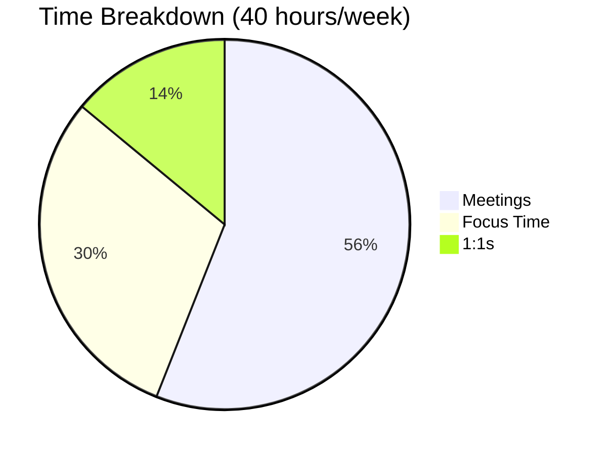
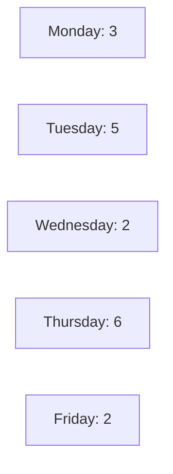

```mermaid
gantt
    title Ideal Weekly Schedule
    dateFormat HH:mm
    section Monday
    Deep Work   :a1, 08:00, 2h
    Meetings    :a2, 10:00, 2h
    section Tuesday
    Deep Work   :b1, 08:00, 2h
    Meetings    :b2, 14:00, 2h
```

# Calendar Analytics Skill

**Expert patterns for time analytics, productivity metrics, trend analysis, and actionable insights**

## Core Principles

1. **Measure to Improve**: Track metrics to drive optimization
2. **Actionable Insights**: Data must lead to concrete actions
3. **Trend Awareness**: Track changes over time, not just snapshots
4. **Comparative Analysis**: Benchmark against targets and ideals
5. **Visual Communication**: Charts and graphs for clarity

---

## Time Categorization

### Standard Categories

**Primary Categories**:
- **Meetings**: Collaborative time with 2+ people
- **Focus Time**: Deep work, blocked focus periods
- **1:1s**: Individual conversations
- **Admin**: Email, planning, organization
- **Learning**: Training, courses, skill development
- **Breaks**: Lunch, coffee, personal time
- **Uncommitted**: Available/unscheduled time

### Auto-Classification

```python
def auto_categorize(event):
    """Automatically categorize calendar events."""
    summary = event['summary'].lower()
    attendees = len(event.get('attendees', []))

    # Priority order matters (check specific before general)

    if any(kw in summary for kw in ['focus', 'deep work', 'coding', 'writing']):
        return 'focus_time'

    if '1:1' in summary or '1-on-1' in summary or attendees == 2:
        return 'one_on_one'

    if any(kw in summary for kw in ['lunch', 'break', 'coffee']):
        return 'break'

    if any(kw in summary for kw in ['training', 'learning', 'course', 'workshop']):
        return 'learning'

    if any(kw in summary for kw in ['admin', 'email', 'planning', 'expenses']):
        return 'admin'

    if attendees > 0:
        return 'meeting'

    return 'uncommitted'
```

---

## Key Metrics

### Time Distribution Metrics

**Total Work Hours**:
- Standard: 40 hours/week
- Calculate: Sum of all categorized time

**Time by Category** (hours and %):
```python
categories = {
    'meetings': 0,
    'focus_time': 0,
    'one_on_ones': 0,
    'admin': 0,
    'learning': 0,
    'breaks': 0,
    'uncommitted': 0
}

for event in events:
    category = auto_categorize(event)
    duration_hours = event['duration_minutes'] / 60
    categories[category] += duration_hours

# Calculate percentages
total_hours = sum(categories.values())
percentages = {k: (v / total_hours * 100) for k, v in categories.items()}
```

**Target Distributions**:

| Category | Individual Contributor | Manager | Executive |
|----------|----------------------|---------|-----------|
| Focus Time | 40-50% | 30-40% | 20-30% |
| Meetings | 20-30% | 30-40% | 40-50% |
| 1:1s | 5-10% | 15-25% | 10-20% |
| Admin | <10% | <10% | <10% |
| Uncommitted | 10-15% | 5-10% | <5% |

### Meeting Load Metrics

**Meeting Statistics**:
```python
meeting_stats = {
    'total_meetings': count_meetings(events),
    'total_hours': sum_meeting_hours(events),
    'average_per_day': count_meetings(events) / working_days,
    'average_duration': average_meeting_duration(events),
    'recurring_count': count_recurring(events),
    'recurring_percentage': recurring_percentage(events),
    'largest_meeting': max_attendees(events),
    'average_attendees': average_attendees(events)
}
```

**Red Flags**:
- >15 meetings/week (too many)
- >50% of time in meetings (meeting overload)
- Average duration >45 min (meetings too long)
- >70% recurring (need audit)
- Average >8 attendees (meetings too large)

### Productivity Metrics

**Focus Time Score**:
```python
def score_focus_time(focus_hours, total_hours):
    """
    Score focus time ratio.

    Targets:
    - Excellent: >40% (16+ hours/week)
    - Good: 30-40% (12-16 hours/week)
    - Fair: 20-30% (8-12 hours/week)
    - Poor: <20% (<8 hours/week)
    """
    ratio = focus_hours / total_hours

    if ratio >= 0.4:
        return {'score': 10, 'level': 'excellent', 'hours': focus_hours}
    elif ratio >= 0.3:
        return {'score': 7, 'level': 'good', 'hours': focus_hours}
    elif ratio >= 0.2:
        return {'score': 4, 'level': 'fair', 'hours': focus_hours}
    else:
        return {'score': 2, 'level': 'poor', 'hours': focus_hours}
```

**Fragmentation Score**:
```python
def calculate_fragmentation(events):
    """
    Measure calendar fragmentation.

    Score: 0-10
    - 0 = Highly fragmented (no continuous blocks)
    - 10 = Well-structured (many continuous blocks)
    """
    score = 10

    # Penalty: Back-to-back meetings
    back_to_back = count_back_to_back(events)
    score -= min(3, back_to_back * 0.3)

    # Penalty: Short gaps (<30 min)
    short_gaps = count_short_gaps(events, max_minutes=30)
    score -= min(3, short_gaps * 0.3)

    # Bonus: 2+ hour focus blocks
    long_blocks = count_long_blocks(events, min_hours=2)
    score += min(3, long_blocks * 0.5)

    # Bonus: Meetings clustered (batched)
    if meetings_clustered(events):
        score += 1

    return max(0, min(10, score))
```

**Overall Productivity Score**:
```python
def calculate_productivity_score(metrics):
    """
    Composite productivity score (0-10).

    Weighted average:
    - Focus time: 40%
    - Meeting load: 30%
    - Fragmentation: 20%
    - Buffer health: 10%
    """
    weights = {
        'focus_time': 0.4,
        'meeting_load': 0.3,
        'fragmentation': 0.2,
        'buffer_health': 0.1
    }

    weighted_score = (
        metrics['focus_time_score'] * weights['focus_time'] +
        metrics['meeting_load_score'] * weights['meeting_load'] +
        metrics['fragmentation_score'] * weights['fragmentation'] +
        metrics['buffer_health_score'] * weights['buffer_health']
    )

    return round(weighted_score, 1)
```

---

## Trend Analysis

### Time Series Metrics

**Weekly Trends**:
```python
def analyze_weekly_trends(historical_data):
    """
    Track metrics week-over-week.

    Metrics to track:
    - Meeting hours
    - Focus hours
    - Productivity score
    - Fragmentation score
    """
    trends = {}

    for metric in ['meetings', 'focus_time', 'productivity', 'fragmentation']:
        values = [week[metric] for week in historical_data]
        trends[metric] = {
            'values': values,
            'direction': calculate_trend_direction(values),
            'change_pct': calculate_change_percentage(values)
        }

    return trends

def calculate_trend_direction(values):
    """Simple trend: comparing first half to second half."""
    if len(values) < 2:
        return 'insufficient_data'

    mid = len(values) // 2
    first_half_avg = sum(values[:mid]) / mid
    second_half_avg = sum(values[mid:]) / (len(values) - mid)

    change_pct = ((second_half_avg - first_half_avg) / first_half_avg) * 100

    if abs(change_pct) < 5:
        return 'stable'
    elif change_pct > 0:
        return 'increasing'
    else:
        return 'decreasing'
```

### Month-over-Month Comparison

```python
def compare_months(current_month, previous_month):
    """Compare current month to previous month."""
    comparison = {}

    metrics = ['meetings', 'meeting_hours', 'focus_hours', 'productivity_score']

    for metric in metrics:
        current = current_month[metric]
        previous = previous_month[metric]

        change = current - previous
        change_pct = (change / previous * 100) if previous > 0 else 0

        comparison[metric] = {
            'current': current,
            'previous': previous,
            'change': change,
            'change_pct': round(change_pct, 1),
            'direction': 'up' if change > 0 else 'down' if change < 0 else 'stable'
        }

    return comparison
```

---

## Visualization

### Mermaid Chart Templates

**Pie Chart - Time Breakdown**:
```markdown

```

**Bar Chart - Meetings by Day**:
```markdown

```

**Gantt Chart - Weekly Schedule**:
```markdown

```

---

## Insight Generation

### Automated Insight Detection

**Pattern Recognition**:
```python
def generate_insights(analytics_data):
    """
    Automatically detect patterns and generate insights.
    """
    insights = []

    # Insight 1: Meeting overload
    if analytics_data['meeting_load'] > 0.5:
        insights.append({
            'type': 'warning',
            'category': 'meeting_overload',
            'title': 'Meeting Overload Detected',
            'description': f"{analytics_data['meeting_load']*100:.0f}% of time in meetings (target: <50%)",
            'impact': 'high',
            'action': 'Run meeting-efficiency-analyzer to identify meetings to eliminate'
        })

    # Insight 2: Low focus time
    if analytics_data['focus_time_ratio'] < 0.3:
        insights.append({
            'type': 'warning',
            'category': 'low_focus_time',
            'title': 'Insufficient Focus Time',
            'description': f"Only {analytics_data['focus_time_hours']} hours/week (target: 15+)",
            'impact': 'high',
            'action': 'Block morning time (8-10am) for deep work'
        })

    # Insight 3: Fragmentation
    if analytics_data['fragmentation_score'] < 5:
        insights.append({
            'type': 'warning',
            'category': 'fragmentation',
            'title': 'Highly Fragmented Calendar',
            'description': f"Fragmentation score: {analytics_data['fragmentation_score']}/10",
            'impact': 'medium',
            'action': 'Batch meetings into windows, create continuous focus blocks'
        })

    # Insight 4: Trend deterioration
    if analytics_data['trend_meeting_load'] == 'increasing':
        insights.append({
            'type': 'alert',
            'category': 'negative_trend',
            'title': 'Meeting Creep Detected',
            'description': 'Meeting load increasing over time',
            'impact': 'medium',
            'action': 'Audit recurring meetings, decline low-value meetings'
        })

    # Insight 5: Energy misalignment
    if analytics_data['morning_meeting_ratio'] > 0.4:
        insights.append({
            'type': 'warning',
            'category': 'energy_misalignment',
            'title': 'Peak Energy Misalignment',
            'description': 'Using high-energy morning time for meetings',
            'impact': 'medium',
            'action': 'Move meetings to afternoon, protect morning for deep work'
        })

    return insights
```

### Recommendation Engine

```python
def generate_recommendations(analytics_data):
    """
    Generate prioritized action recommendations.
    """
    recommendations = []

    # Quick wins (high impact, low effort)
    if analytics_data['back_to_back_meetings'] > 5:
        recommendations.append({
            'priority': 1,
            'category': 'quick_win',
            'action': 'Add 15-minute buffers between all meetings',
            'impact': 'high',
            'effort': 'low',
            'time_saved': f"{analytics_data['back_to_back_meetings'] * 15} minutes/week"
        })

    # High impact (transformative changes)
    if analytics_data['focus_time_hours'] < 12:
        recommendations.append({
            'priority': 2,
            'category': 'transformative',
            'action': 'Block daily 8-10am for deep work',
            'impact': 'high',
            'effort': 'medium',
            'time_saved': '10 hours focus time/week'
        })

    # Optimization (incremental improvements)
    if analytics_data['average_meeting_duration'] > 45:
        recommendations.append({
            'priority': 3,
            'category': 'optimization',
            'action': 'Apply 25/50-minute rule to all meetings',
            'impact': 'medium',
            'effort': 'low',
            'time_saved': f"{calculate_duration_savings(analytics_data)} hours/week"
        })

    # Sort by priority
    recommendations.sort(key=lambda r: r['priority'])

    return recommendations
```

---

## Reporting

### Executive Summary Template

```markdown
# Calendar Health Report

**Period**: [Date Range]
**Productivity Score**: X/10 ([Excellent/Good/Fair/Poor])

## Key Metrics
- Meeting Load: XX% (Target: <50%)
- Focus Time: XX hours/week (Target: 15+)
- Fragmentation: X/10 (Target: 7+)

## Top 3 Issues
1. [Issue 1 with impact]
2. [Issue 2 with impact]
3. [Issue 3 with impact]

## Top 3 Actions
1. [Action 1] → [Time saved]
2. [Action 2] → [Time saved]
3. [Action 3] → [Time saved]

**Total Potential Savings**: XX hours/week
```

### Detailed Dashboard Template

See `analytics-dashboard-template.md` for full template

---

## Quality Checklist

- [ ] All time accurately categorized
- [ ] Meeting load calculated
- [ ] Focus time ratio measured
- [ ] Fragmentation score computed
- [ ] Trends identified (weekly, monthly)
- [ ] Insights auto-generated
- [ ] Recommendations prioritized
- [ ] Visualizations included
- [ ] Before/after comparisons shown
- [ ] Action plan provided

---

**Version**: 1.0
**Last Updated**: January 2025
**Use Cases**: Calendar analytics, productivity tracking, optimization measurement
