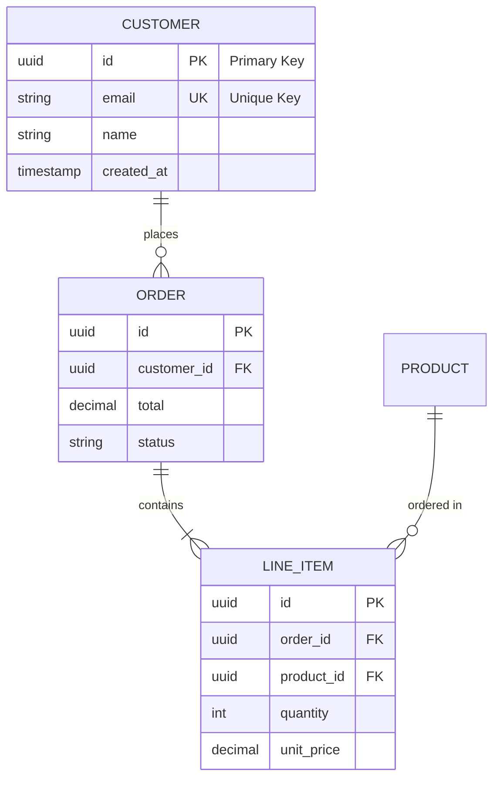

# Schema Design Skill

Expert patterns for relational database schema design, normalization, and constraint management.

## Core Principles

### 1. Normalization Levels

**1NF (First Normal Form)**:
- Atomic values only (no arrays, no comma-separated lists)
- Each column contains single value
- No repeating groups

**2NF (Second Normal Form)**:
- Must be in 1NF
- No partial dependencies on composite primary keys
- Every non-key column depends on the entire primary key

**3NF (Third Normal Form)**:
- Must be in 2NF
- No transitive dependencies
- Every non-key column depends only on the primary key

**BCNF (Boyce-Codd Normal Form)**:
- Must be in 3NF
- Every determinant is a candidate key

**Strategic Denormalization**:
- Only denormalize with performance data justification
- Document the trade-off
- Consider materialized views instead
- Plan for data consistency maintenance

### 2. Primary Key Selection

**UUID (Recommended for distributed systems)**:
```sql
id UUID PRIMARY KEY DEFAULT uuid_generate_v4()
```
- Pros: Globally unique, no coordination needed, harder to enumerate
- Cons: Larger storage (16 bytes), random order (index fragmentation)

**Auto-increment Integer**:
```sql
id SERIAL PRIMARY KEY  -- PostgreSQL
id INT AUTO_INCREMENT PRIMARY KEY  -- MySQL
id INTEGER PRIMARY KEY AUTOINCREMENT  -- SQLite
```
- Pros: Small storage (4-8 bytes), sequential (better index performance)
- Cons: Coordination needed, easy to enumerate, not globally unique

**Composite Keys** (for junction tables):
```sql
PRIMARY KEY (user_id, role_id)
```

### 3. Foreign Key Constraints

**Always define foreign keys** for referential integrity:

```sql
CONSTRAINT fk_orders_customer
    FOREIGN KEY (customer_id)
    REFERENCES customers(id)
    ON DELETE CASCADE  -- or RESTRICT, SET NULL
    ON UPDATE CASCADE
```

**ON DELETE options**:
- `CASCADE`: Delete child rows when parent deleted
- `RESTRICT`: Prevent delete if children exist
- `SET NULL`: Set foreign key to NULL
- `NO ACTION`: Similar to RESTRICT (database-specific)

### 4. Check Constraints

**Use check constraints for business rules**:

```sql
-- Email format validation
CONSTRAINT email_format CHECK (
    email ~* '^[A-Za-z0-9._%+-]+@[A-Za-z0-9.-]+\.[A-Z|a-z]{2,}$'
)

-- Positive values
CONSTRAINT total_positive CHECK (total >= 0)

-- Enum-like values
CONSTRAINT valid_status CHECK (
    status IN ('pending', 'processing', 'completed', 'cancelled')
)

-- Date ranges
CONSTRAINT valid_date_range CHECK (end_date > start_date)
```

### 5. Index Strategy

**Index Types and When to Use**:

**B-Tree (Default)**:
- WHERE clauses: `WHERE status = 'active'`
- ORDER BY: `ORDER BY created_at DESC`
- Range queries: `WHERE price BETWEEN 10 AND 100`
- Joins: Foreign key columns

**GIN (PostgreSQL - Generalized Inverted Index)**:
- JSONB columns: `WHERE data @> '{"key": "value"}'`
- Arrays: `WHERE tags @> ARRAY['postgresql']`
- Full-text search: `WHERE to_tsvector(text) @@ to_tsquery('search')`

**GiST (PostgreSQL - Generalized Search Tree)**:
- Geometric data: `WHERE location && box '((0,0),(1,1))'`
- Full-text search: Alternative to GIN
- Range types: `WHERE daterange && '[2025-01-01, 2025-12-31]'`

**Hash (Limited use)**:
- Equality only: `WHERE id = 123`
- Not recommended (B-tree usually better)

**Composite Index Column Order**:
```sql
-- Rule: Most selective column first, or most commonly filtered
CREATE INDEX idx_orders_status_created ON orders(status, created_at DESC);

-- Works for:
-- WHERE status = 'pending'  ✅
-- WHERE status = 'pending' AND created_at > NOW() - INTERVAL '7 days'  ✅
-- WHERE status = 'pending' ORDER BY created_at DESC  ✅

-- Does NOT work for:
-- WHERE created_at > NOW() - INTERVAL '7 days'  ❌ (doesn't start with status)
```

## Schema Patterns

### Pattern 1: Soft Delete

```sql
CREATE TABLE users (
    id UUID PRIMARY KEY DEFAULT uuid_generate_v4(),
    email VARCHAR(255) NOT NULL,
    name VARCHAR(255) NOT NULL,
    deleted_at TIMESTAMP NULL,
    created_at TIMESTAMP DEFAULT CURRENT_TIMESTAMP,
    updated_at TIMESTAMP DEFAULT CURRENT_TIMESTAMP
);

-- Partial unique index (only for non-deleted rows)
CREATE UNIQUE INDEX idx_users_email_active
ON users(email)
WHERE deleted_at IS NULL;

-- Query pattern: Always filter deleted
SELECT * FROM users WHERE deleted_at IS NULL;
```

### Pattern 2: Audit Trail

```sql
CREATE TABLE users (
    id UUID PRIMARY KEY DEFAULT uuid_generate_v4(),
    email VARCHAR(255) NOT NULL,
    name VARCHAR(255) NOT NULL,
    created_at TIMESTAMP DEFAULT CURRENT_TIMESTAMP,
    created_by UUID REFERENCES users(id),
    updated_at TIMESTAMP DEFAULT CURRENT_TIMESTAMP,
    updated_by UUID REFERENCES users(id)
);

-- Separate audit log table for full history
CREATE TABLE users_audit (
    audit_id UUID PRIMARY KEY DEFAULT uuid_generate_v4(),
    user_id UUID NOT NULL,
    operation VARCHAR(10) NOT NULL,  -- INSERT, UPDATE, DELETE
    old_values JSONB,
    new_values JSONB,
    changed_by UUID REFERENCES users(id),
    changed_at TIMESTAMP DEFAULT CURRENT_TIMESTAMP
);
```

### Pattern 3: Many-to-Many with Metadata

```sql
-- Junction table with additional attributes
CREATE TABLE user_roles (
    user_id UUID REFERENCES users(id) ON DELETE CASCADE,
    role_id UUID REFERENCES roles(id) ON DELETE CASCADE,
    granted_by UUID REFERENCES users(id),
    granted_at TIMESTAMP DEFAULT CURRENT_TIMESTAMP,
    expires_at TIMESTAMP,

    PRIMARY KEY (user_id, role_id)
);

CREATE INDEX idx_user_roles_user ON user_roles(user_id);
CREATE INDEX idx_user_roles_role ON user_roles(role_id);
CREATE INDEX idx_user_roles_expires ON user_roles(expires_at)
WHERE expires_at IS NOT NULL;
```

### Pattern 4: Hierarchical Data (Adjacency List)

```sql
CREATE TABLE categories (
    id UUID PRIMARY KEY DEFAULT uuid_generate_v4(),
    name VARCHAR(255) NOT NULL,
    parent_id UUID REFERENCES categories(id),
    path TEXT,  -- Materialized path: /electronics/computers/laptops
    level INT,  -- Denormalized for performance
    created_at TIMESTAMP DEFAULT CURRENT_TIMESTAMP
);

CREATE INDEX idx_categories_parent ON categories(parent_id);
CREATE INDEX idx_categories_path ON categories(path);
```

### Pattern 5: Polymorphic Associations (Avoid if Possible)

**❌ Problematic Approach**:
```sql
-- Weak referential integrity
CREATE TABLE comments (
    id UUID PRIMARY KEY,
    content TEXT NOT NULL,
    commentable_type VARCHAR(50),  -- 'Post' or 'Photo'
    commentable_id UUID,           -- No real foreign key!
    created_at TIMESTAMP
);
```

**✅ Better Approach (Exclusive Arcs)**:
```sql
CREATE TABLE comments (
    id UUID PRIMARY KEY,
    content TEXT NOT NULL,
    post_id UUID REFERENCES posts(id) ON DELETE CASCADE,
    photo_id UUID REFERENCES photos(id) ON DELETE CASCADE,
    created_at TIMESTAMP,

    -- Exactly one must be set
    CONSTRAINT one_commentable CHECK (
        (post_id IS NOT NULL AND photo_id IS NULL) OR
        (post_id IS NULL AND photo_id IS NOT NULL)
    )
);

CREATE INDEX idx_comments_post ON comments(post_id);
CREATE INDEX idx_comments_photo ON comments(photo_id);
```

## Naming Conventions

**Tables**: Plural nouns, lowercase, underscores
```
users, orders, order_items, user_preferences
```

**Columns**: Singular nouns, lowercase, underscores
```
id, email, first_name, created_at, customer_id
```

**Primary Keys**: Always `id`
```
id UUID PRIMARY KEY
```

**Foreign Keys**: `{referenced_table_singular}_id`
```
customer_id, product_id, user_id
```

**Indexes**: `idx_{table}_{column(s)}[_{condition}]`
```
idx_users_email
idx_orders_customer_id
idx_orders_status_created
idx_users_email_active (partial index)
```

**Constraints**: `{type}_{table}_{description}`
```
pk_users (primary key)
fk_orders_customer (foreign key)
uq_users_email (unique)
ck_orders_total_positive (check)
```

## Common Anti-Patterns to Avoid

**❌ Generic JSON Columns (EAV Pattern)**:
```sql
-- Bad: No schema, no constraints, no indexes
CREATE TABLE entities (
    id UUID PRIMARY KEY,
    type VARCHAR(50),
    attributes JSONB
);
```

**❌ Comma-Separated Lists**:
```sql
-- Bad: Violates 1NF, can't join efficiently
CREATE TABLE users (
    id UUID PRIMARY KEY,
    tags TEXT  -- 'javascript,python,sql'
);
```

**✅ Use junction table instead**:
```sql
CREATE TABLE user_tags (
    user_id UUID REFERENCES users(id),
    tag_id UUID REFERENCES tags(id),
    PRIMARY KEY (user_id, tag_id)
);
```

**❌ Nullable Boolean Columns**:
```sql
-- Bad: Three states (true, false, null) - ambiguous
is_active BOOLEAN NULL
```

**✅ Be explicit**:
```sql
-- Good: Two clear states
is_active BOOLEAN NOT NULL DEFAULT true
```

## ER Diagram Notation (Mermaid)



**Cardinality Symbols**:
- `||--||` : One to exactly one
- `||--o|` : One to zero or one
- `||--o{` : One to zero or more
- `}|--|{` : One or more to one or more

## Database-Specific Best Practices

### PostgreSQL

```sql
-- Enable UUID extension
CREATE EXTENSION IF NOT EXISTS "uuid-ossp";

-- Use JSONB (not JSON) for better performance
metadata JSONB

-- Use array types when appropriate
tags TEXT[]

-- Use full-text search
CREATE INDEX idx_products_search ON products
USING GIN (to_tsvector('english', name || ' ' || description));

-- Use enums for fixed sets
CREATE TYPE order_status AS ENUM ('pending', 'processing', 'completed', 'cancelled');
```

### MySQL

```sql
-- Use InnoDB engine (default in 8.0+)
ENGINE=InnoDB

-- Use UTF8MB4 for full Unicode support (including emoji)
DEFAULT CHARSET=utf8mb4 COLLATE=utf8mb4_unicode_ci

-- Use generated columns for computed values
price_with_tax DECIMAL(10,2) GENERATED ALWAYS AS (price * 1.20) STORED

-- Partition large tables
PARTITION BY RANGE (YEAR(created_at)) (
    PARTITION p2023 VALUES LESS THAN (2024),
    PARTITION p2024 VALUES LESS THAN (2025),
    PARTITION p2025 VALUES LESS THAN (2026)
);
```

### SQLite

```sql
-- Use STRICT tables for type enforcement (3.37+)
CREATE TABLE users (
    id INTEGER PRIMARY KEY,
    email TEXT NOT NULL,
    age INTEGER NOT NULL
) STRICT;

-- Use WITHOUT ROWID for space efficiency
CREATE TABLE user_settings (
    user_id INTEGER PRIMARY KEY,
    theme TEXT NOT NULL,
    locale TEXT NOT NULL
) WITHOUT ROWID;

-- Use triggers for complex constraints
CREATE TRIGGER check_age_before_insert
BEFORE INSERT ON users
FOR EACH ROW
WHEN NEW.age < 18
BEGIN
    SELECT RAISE(ABORT, 'Users must be 18 or older');
END;
```

## Quality Checklist

**Schema Completeness**:
- [ ] All tables have primary keys
- [ ] All relationships have foreign keys
- [ ] Appropriate NOT NULL constraints
- [ ] Check constraints for business rules
- [ ] Default values where appropriate
- [ ] Created_at/updated_at timestamps

**Normalization**:
- [ ] Schema is at least 3NF
- [ ] No repeating groups
- [ ] No partial dependencies
- [ ] No transitive dependencies
- [ ] Denormalization justified and documented

**Performance**:
- [ ] Indexes on all foreign keys
- [ ] Indexes on commonly filtered columns
- [ ] Composite indexes for multi-column queries
- [ ] Covering indexes for frequent queries
- [ ] Partial indexes where appropriate

**Maintainability**:
- [ ] Consistent naming conventions
- [ ] Clear table and column names
- [ ] Comments on complex structures
- [ ] ER diagram provided
- [ ] Design decisions documented

This skill represents industry best practices for relational database schema design.
