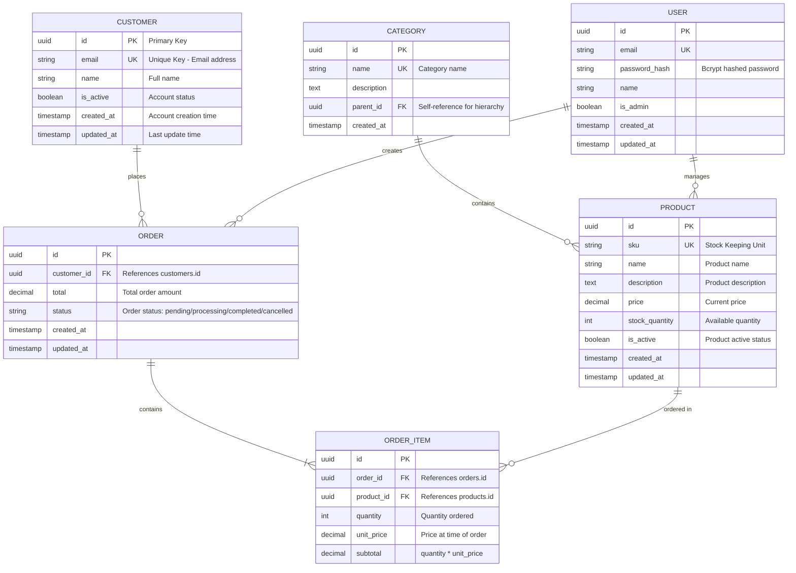

# Entity-Relationship Diagram

## Overview

This ER diagram represents the database schema for [PROJECT NAME].

**Database**: PostgreSQL 14+ / MySQL 8+ / SQLite 3.35+
**Created**: [DATE]
**Last Updated**: [DATE]

## Diagram

## Relationship Cardinality

| Relationship | Type | Description |
|--------------|------|-------------|
| CUSTOMER → ORDER | One to Many | A customer can place multiple orders |
| ORDER → ORDER_ITEM | One to Many | An order contains one or more items |
| PRODUCT → ORDER_ITEM | One to Many | A product can be in many order items |
| CATEGORY → PRODUCT | One to Many | A category can contain multiple products |
| CATEGORY → CATEGORY | One to One (optional) | Categories can have parent categories (hierarchy) |
| USER → ORDER | One to Many | A user (admin) can create/manage orders |
| USER → PRODUCT | One to Many | A user (admin) can manage products |

## Legend

- **PK**: Primary Key
- **FK**: Foreign Key
- **UK**: Unique Key
- `||--o{`: One to zero or more
- `||--|{`: One to one or more
- `||--||`: One to exactly one
- `||--o|`: One to zero or one

## Tables

### customers

**Purpose**: Stores customer account information

**Key Columns**:
- `id`: Unique identifier (UUID)
- `email`: Login email (unique, indexed)
- `name`: Customer full name
- `is_active`: Account status flag
- `created_at`, `updated_at`: Audit timestamps

**Indexes**:
- PRIMARY KEY on `id`
- UNIQUE INDEX on `email`
- INDEX on `created_at` (for sorting)

### orders

**Purpose**: Stores customer orders

**Key Columns**:
- `id`: Unique identifier (UUID)
- `customer_id`: References `customers.id` (foreign key, indexed)
- `total`: Order total amount (calculated from items)
- `status`: Order status (pending, processing, completed, cancelled)
- `created_at`, `updated_at`: Audit timestamps

**Indexes**:
- PRIMARY KEY on `id`
- INDEX on `customer_id` (foreign key)
- INDEX on `status` (for filtering)
- INDEX on `created_at` (for sorting)

**Constraints**:
- `total >= 0` (CHECK constraint)
- `status IN ('pending', 'processing', 'completed', 'cancelled')` (CHECK constraint)

### order_items

**Purpose**: Junction table linking orders and products with quantity/price

**Key Columns**:
- `id`: Unique identifier (UUID)
- `order_id`: References `orders.id` (foreign key, indexed)
- `product_id`: References `products.id` (foreign key, indexed)
- `quantity`: Number of units ordered
- `unit_price`: Price per unit at time of order (historical)
- `subtotal`: Calculated as `quantity * unit_price`

**Indexes**:
- PRIMARY KEY on `id`
- INDEX on `order_id` (foreign key)
- INDEX on `product_id` (foreign key)

**Constraints**:
- `quantity > 0` (CHECK constraint)
- `unit_price >= 0` (CHECK constraint)

### products

**Purpose**: Stores product catalog

**Key Columns**:
- `id`: Unique identifier (UUID)
- `sku`: Stock Keeping Unit (unique, indexed)
- `name`: Product name
- `description`: Product description
- `price`: Current selling price
- `stock_quantity`: Available inventory
- `is_active`: Whether product is currently available
- `created_at`, `updated_at`: Audit timestamps

**Indexes**:
- PRIMARY KEY on `id`
- UNIQUE INDEX on `sku`
- INDEX on `is_active` (partial index WHERE is_active = true)

**Constraints**:
- `price >= 0` (CHECK constraint)
- `stock_quantity >= 0` (CHECK constraint)

### categories

**Purpose**: Hierarchical product categorization

**Key Columns**:
- `id`: Unique identifier (UUID)
- `name`: Category name (unique)
- `description`: Category description
- `parent_id`: Self-referencing foreign key for hierarchy (nullable)
- `created_at`: Creation timestamp

**Indexes**:
- PRIMARY KEY on `id`
- UNIQUE INDEX on `name`
- INDEX on `parent_id` (for hierarchy traversal)

**Constraints**:
- `parent_id` can be NULL (top-level categories)
- Foreign key to self for parent-child relationship

### users

**Purpose**: System users (admins, staff)

**Key Columns**:
- `id`: Unique identifier (UUID)
- `email`: Login email (unique, indexed)
- `password_hash`: Bcrypt hashed password
- `name`: User full name
- `is_admin`: Admin privilege flag
- `created_at`, `updated_at`: Audit timestamps

**Indexes**:
- PRIMARY KEY on `id`
- UNIQUE INDEX on `email`

**Security Notes**:
- Never store passwords in plaintext
- Use bcrypt or argon2 for password hashing
- Consider adding `last_login_at` for security auditing

## Design Decisions

### Why UUIDs for Primary Keys?

- Globally unique (no coordination needed across systems)
- Harder to enumerate than auto-increment integers
- Suitable for distributed systems
- Trade-off: Larger storage (16 bytes vs 4/8 bytes)

### Why Denormalize `subtotal` in order_items?

- Historical price preservation (product price may change)
- Query performance (avoid calculation on every read)
- Trade-off: Must maintain consistency with `quantity * unit_price`

### Why Soft Delete Pattern Not Used?

- For this schema, hard deletes are acceptable
- If audit trail needed, consider adding `deleted_at` column
- Alternative: Separate audit log tables

## Migration Path

If migrating from existing schema:

1. **Add new tables** (orders, order_items, categories)
2. **Migrate data** from old schema
3. **Add foreign keys** (use NOT VALID, then VALIDATE)
4. **Drop old tables** (after verification)

## Performance Considerations

**Expected Query Patterns**:
- Frequent: Orders by customer, products by category
- Occasional: Order history, product search
- Rare: Analytics, reporting

**Index Strategy**:
- All foreign keys indexed
- Common filter columns indexed (status, is_active)
- Composite indexes for multi-column queries

**Scalability**:
- For >10M orders: Consider partitioning by created_at
- For high-traffic: Add read replicas
- For caching: Consider Redis for product catalog
