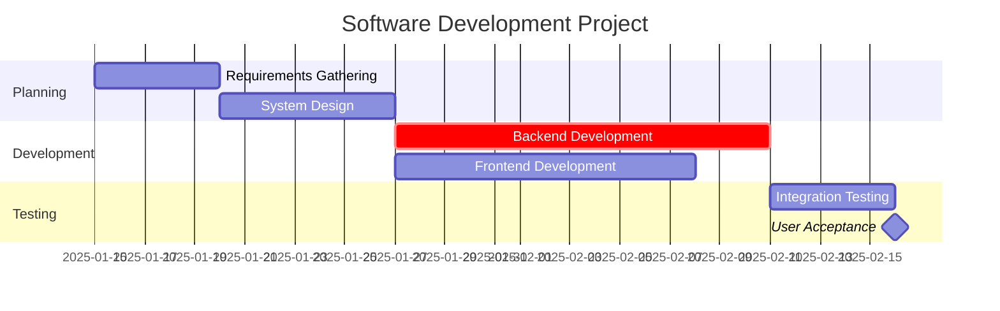

# Gantt Chart Visualization Skill

**Version**: 1.0.0
**Last Updated**: 2025-01-21
**Category**: Project Visualization

## Overview

This skill provides comprehensive guidance on creating effective Gantt charts using Mermaid syntax for timeline visualization, milestone tracking, dependency representation, and schedule communication.

## When to Use This Skill

Use this skill when:
- Creating project timelines and schedules
- Visualizing task dependencies
- Tracking project milestones
- Communicating schedule to stakeholders
- Analyzing critical paths
- Planning resource allocation over time
- Showing progress on projects

## Mermaid Gantt Syntax

### Basic Structure

```mermaid
gantt
    title Project Title
    dateFormat YYYY-MM-DD

    section Section Name
    Task Name :task_id, start_date, duration
```

### Complete Example



## Gantt Chart Elements

### 1. Chart Configuration

#### Title
```mermaid
gantt
    title Your Project Name Here
```
- Keep concise and descriptive
- Include project identifier if multiple projects
- Example: "Q1 2025 Product Launch"

#### Date Format
```mermaid
dateFormat YYYY-MM-DD
```
- Standard format: `YYYY-MM-DD` (e.g., 2025-01-15)
- Alternative: `DD-MM-YYYY` for European format
- Alternative: `MM-DD-YYYY` for US format
- **Recommendation**: Use ISO 8601 (YYYY-MM-DD) for international compatibility

#### Axis Format (Optional)
```mermaid
axisFormat %m/%d
```
- Customize how dates appear on timeline
- `%Y`: Year (2025)
- `%m`: Month (01)
- `%d`: Day (15)
- `%b`: Month name (Jan)
- Example: `%b %d` shows "Jan 15"

### 2. Sections

Sections organize tasks into logical groups (phases, workstreams, teams).

```mermaid
section Section Name
```

**Common Section Patterns**:

#### By Project Phase
```mermaid
section Initiation
section Planning
section Execution
section Testing
section Deployment
section Closure
```

#### By Workstream
```mermaid
section Backend Development
section Frontend Development
section DevOps
section QA
section Documentation
```

#### By Team
```mermaid
section Engineering Team
section Design Team
section Product Team
section Marketing Team
```

### 3. Tasks

Task syntax: `Task Name :modifiers, task_id, timing, duration`

#### Basic Task
```mermaid
Task Name :task1, 2025-01-15, 5d
```
- `Task Name`: Displayed label
- `task1`: Unique identifier for dependencies
- `2025-01-15`: Start date
- `5d`: Duration (5 days)

#### Duration Formats
- `Xd`: Days (e.g., `5d`)
- `Xw`: Weeks (e.g., `2w`)
- `Xh`: Hours (e.g., `16h`)
- Specific end date: `2025-01-15, 2025-01-20`

#### Task with Dependency
```mermaid
Task B :task2, after task1, 3d
```
- `after task1`: Starts when task1 finishes (Finish-to-Start)
- Can depend on multiple: `after task1 task2 task3`

#### Critical Path Task
```mermaid
Critical Task :crit, task3, 2025-01-20, 10d
```
- `crit`: Marks as critical path (displayed in red)
- Use for tasks with zero float/slack

#### Active Task (In Progress)
```mermaid
Current Task :active, task4, 2025-01-25, 5d
```
- `active`: Highlights as currently in progress
- Use for status tracking

#### Completed Task
```mermaid
Finished Task :done, task5, 2025-01-15, 5d
```
- `done`: Shows as completed (different styling)
- Use when updating progress

#### Milestone
```mermaid
Major Milestone :milestone, m1, 2025-02-01, 0d
```
- `milestone`: Renders as diamond marker
- `0d` duration: Milestones are point-in-time events
- Use for key dates, deliverables, approvals

#### Multiple Modifiers
```mermaid
Critical Active Task :crit, active, task6, 2025-02-05, 7d
```
- Can combine: `crit, active`, `crit, done`, etc.
- Order doesn't matter

### 4. Dependencies

#### Types of Dependencies

##### Finish-to-Start (Most Common)
```mermaid
Task A :task_a, 2025-01-15, 5d
Task B :task_b, after task_a, 3d
```
Task B starts after Task A finishes.

##### Multiple Dependencies
```mermaid
Task A :task_a, 2025-01-15, 5d
Task B :task_b, 2025-01-15, 5d
Task C :task_c, after task_a task_b, 3d
```
Task C starts after both A and B finish.

##### Parallel Tasks (No Dependency)
```mermaid
Task A :task_a, 2025-01-15, 5d
Task B :task_b, 2025-01-15, 5d
```
Both start simultaneously.

## Gantt Chart Best Practices

### 1. Structure and Organization

#### Use Logical Sections
Group related tasks into sections:
```mermaid
section Phase 1: Discovery
Requirements Gathering    :req, 2025-01-15, 5d
Stakeholder Interviews    :interviews, 2025-01-15, 3d

section Phase 2: Design
Architecture Design       :arch, after req, 7d
UI/UX Design             :ux, after req, 7d
```

#### Hierarchical Naming
Use indentation or numbering in task names:
```mermaid
section Development
Backend Development       :dev1, 2025-02-01, 20d
  - API Development       :dev1a, 2025-02-01, 10d
  - Database Setup        :dev1b, 2025-02-01, 5d
Frontend Development      :dev2, 2025-02-08, 15d
  - Component Library     :dev2a, 2025-02-08, 7d
  - Page Development      :dev2b, after dev2a, 8d
```

#### Consistent Granularity
Keep tasks at similar level of detail within sections:
- ✅ Good: All tasks 2-10 days
- ❌ Bad: Mix of 1-hour and 3-week tasks

### 2. Timeline and Scheduling

#### Use Realistic Durations
- Include buffer for uncertainties (15-20%)
- Account for part-time allocation
- Consider holidays and time off
- Factor in meetings and overhead

#### Show Critical Path
Mark critical path tasks with `crit`:
```mermaid
Requirements    :crit, req, 2025-01-15, 5d
Design         :crit, design, after req, 7d
Development    :crit, dev, after design, 15d
Testing        :test, after dev, 5d
Deployment     :crit, deploy, after test, 2d
```

#### Include Milestones
Mark key dates and decision points:
```mermaid
Project Kickoff         :milestone, m1, 2025-01-15, 0d
Design Approval         :milestone, m2, 2025-02-01, 0d
Development Complete    :milestone, m3, 2025-03-01, 0d
Go-Live                :milestone, m4, 2025-04-01, 0d
```

### 3. Visual Clarity

#### Limit Number of Tasks
- **Recommendation**: 15-30 tasks per chart
- Too many tasks = cluttered, hard to read
- Too few tasks = not enough detail
- Create multiple charts for large projects (by phase or workstream)

#### Use Descriptive Names
- ✅ Good: "Backend API Development - User Service"
- ❌ Bad: "Dev Task 1"
- Keep names concise but meaningful
- Use consistent naming conventions

#### Color Coding via Modifiers
- **Red** (Critical): Tasks on critical path
- **Blue** (Active): Currently in progress
- **Gray** (Done): Completed tasks
- **Green** (Normal): Regular tasks

### 4. Dependency Management

#### Show Key Dependencies Only
```mermaid
# ✅ Good: Show critical dependencies
Requirements :req, 2025-01-15, 5d
Design      :design, after req, 7d
Development :dev, after design, 15d

# ❌ Bad: Over-connected spaghetti
Task A :a, 2025-01-15, 2d
Task B :b, after a, 2d
Task C :c, after b, 2d
Task D :d, after c, 2d
[15 more connected tasks...]
```

#### Document External Dependencies
Use task names or notes to indicate external dependencies:
```mermaid
Wait for API Access (External) :external1, 2025-02-01, 5d
API Integration                :dev1, after external1, 10d
```

### 5. Progress Tracking

#### Update Task Status
```mermaid
# Completed tasks
Requirements Gathering :done, req, 2025-01-15, 5d
Design Phase          :done, design, after req, 7d

# In progress
Development           :active, dev, after design, 15d

# Not started
Testing              :test, after dev, 5d
Deployment           :deploy, after test, 2d
```

#### Show Percentage Complete
Add to task description:
```mermaid
Development (60% complete) :active, dev, 2025-02-01, 20d
```

## Common Gantt Chart Patterns

### Pattern 1: Waterfall Project

Sequential phases with clear handoffs:
```mermaid
gantt
    title Waterfall Project Timeline
    dateFormat YYYY-MM-DD

    section Initiation
    Project Charter        :done, init1, 2025-01-15, 3d
    Kickoff Meeting       :done, init2, after init1, 1d

    section Requirements
    Gather Requirements   :done, req1, after init2, 10d
    Document Requirements :done, req2, after req1, 5d
    Requirements Approval :milestone, m1, after req2, 0d

    section Design
    System Design         :active, design1, after m1, 10d
    Database Design       :active, design2, after m1, 7d
    Design Review        :milestone, m2, after design1 design2, 0d

    section Development
    Backend Development   :crit, dev1, after m2, 20d
    Frontend Development  :dev2, after m2, 20d

    section Testing
    Integration Testing   :test1, after dev1 dev2, 10d
    UAT                  :crit, test2, after test1, 10d

    section Deployment
    Production Deploy     :milestone, deploy, after test2, 1d
```

### Pattern 2: Agile Sprint

Iterative sprints with ceremonies:
```mermaid
gantt
    title Agile Sprint Timeline (2 Weeks)
    dateFormat YYYY-MM-DD

    section Sprint Planning
    Sprint Planning       :milestone, sp1, 2025-01-20, 0d

    section Sprint 1
    User Story 1         :active, us1, 2025-01-20, 5d
    User Story 2         :active, us2, 2025-01-20, 3d
    User Story 3         :us3, after us2, 4d
    Daily Standups       :2025-01-20, 10d

    section Sprint Review
    Sprint Demo          :milestone, demo1, 2025-01-31, 0d
    Sprint Retrospective :retro1, after demo1, 1d
```

### Pattern 3: Parallel Workstreams

Multiple teams working simultaneously:
```mermaid
gantt
    title Multi-Team Project
    dateFormat YYYY-MM-DD

    section Backend Team
    API Development      :crit, be1, 2025-01-15, 20d
    Database Schema      :be2, 2025-01-15, 10d
    Business Logic       :be3, after be2, 15d

    section Frontend Team
    Component Library    :fe1, 2025-01-15, 10d
    Page Development     :fe2, after fe1, 15d
    Integration         :fe3, after fe2 be1, 5d

    section QA Team
    Test Plan           :qa1, 2025-01-20, 5d
    Test Automation     :qa2, after qa1, 15d
    Testing Phase       :crit, qa3, after fe3, 10d

    section Milestones
    Development Complete :milestone, m1, after be3 fe3, 0d
    Testing Complete    :milestone, m2, after qa3, 0d
```

### Pattern 4: Resource Timeline

Show resource allocation over time:
```mermaid
gantt
    title Resource Allocation Timeline
    dateFormat YYYY-MM-DD

    section Project Manager (100%)
    Full Project Duration :pm1, 2025-01-15, 90d

    section Tech Lead (100%)
    Planning & Design     :tl1, 2025-01-15, 15d
    Development Support   :tl2, after tl1, 40d
    Deployment           :tl3, after tl2, 10d

    section Developer Team (3 devs)
    Architecture Review   :dev1, 2025-01-20, 10d
    Development          :dev2, after dev1, 40d
    Bug Fixing           :dev3, after dev2, 15d

    section QA Team (2 testers)
    Test Planning        :qa1, 2025-02-01, 10d
    Testing             :qa2, after qa1, 25d
```

## Timeline Optimization

### Fast-Tracking

Execute tasks in parallel that were planned in sequence:
```mermaid
# Before (Sequential)
section Original Plan
Design    :design, 2025-01-15, 10d
Build     :build, after design, 20d
Test      :test, after build, 10d

# After (Fast-Tracked)
section Optimized Plan
Design    :design2, 2025-01-15, 10d
Build     :crit, build2, 2025-01-20, 20d  # Starts before design complete
Test      :test2, 2025-02-05, 10d          # Overlaps with build
```

**Risk**: Increased rework if design changes.

### Crashing

Add resources to shorten critical path duration:
```mermaid
# Before (1 developer)
Development :crit, dev1, 2025-01-15, 20d

# After (2 developers, crashing)
Development :crit, dev2, 2025-01-15, 12d  # Reduced from 20d
```

**Cost**: Additional resources cost more.

## Exporting and Sharing

### Rendering Gantt Charts

Mermaid Gantt charts render in:
- **GitHub/GitLab**: Native support in README files
- **VS Code**: With Mermaid extension
- **Notion**: With Mermaid support
- **Confluence**: With Mermaid plugin
- **Mermaid Live Editor**: https://mermaid.live

### PDF Export

1. Render in browser (GitHub, Mermaid Live Editor)
2. Print to PDF
3. Share PDF with stakeholders

### Integration with Tools

#### Microsoft Project
- Export task list from Gantt chart
- Import into MS Project
- Enhanced features: Resource loading, budget tracking

#### Jira/Asana
- Use Gantt chart for planning
- Create issues/tasks in tracking tool
- Link back to Gantt for timeline view

## Common Mistakes to Avoid

### 1. Syntax Errors

❌ **Bad**:
```mermaid
gantt
    Task Name :2025-01-15, 5d  # Missing task ID
```

✅ **Good**:
```mermaid
gantt
    Task Name :task1, 2025-01-15, 5d
```

### 2. Date Format Inconsistency

❌ **Bad**:
```mermaid
gantt
    dateFormat YYYY-MM-DD
    Task :task1, 01/15/2025, 5d  # Wrong format
```

✅ **Good**:
```mermaid
gantt
    dateFormat YYYY-MM-DD
    Task :task1, 2025-01-15, 5d
```

### 3. Missing Dependencies

❌ **Bad**: Tasks float with no relationships
```mermaid
Task A :a, 2025-01-15, 5d
Task B :b, 2025-01-20, 5d
Task C :c, 2025-01-25, 5d
```

✅ **Good**: Clear dependencies shown
```mermaid
Task A :a, 2025-01-15, 5d
Task B :b, after a, 5d
Task C :c, after b, 5d
```

### 4. Too Much Detail

❌ **Bad**: 100 micro-tasks
```mermaid
Write function A :f1, 2025-01-15, 4h
Write function B :f2, after f1, 6h
Write function C :f3, after f2, 5h
[97 more tasks...]
```

✅ **Good**: Appropriate granularity
```mermaid
Core Module Development :mod1, 2025-01-15, 5d
API Integration         :mod2, after mod1, 3d
Testing                :test1, after mod2, 2d
```

### 5. No Milestones

❌ **Bad**: Just tasks
```mermaid
Planning    :plan, 2025-01-15, 10d
Development :dev, after plan, 20d
Testing     :test, after dev, 10d
```

✅ **Good**: Key milestones marked
```mermaid
Planning            :plan, 2025-01-15, 10d
Planning Approved   :milestone, m1, after plan, 0d
Development         :dev, after m1, 20d
Dev Complete        :milestone, m2, after dev, 0d
Testing            :test, after m2, 10d
Go-Live            :milestone, m3, after test, 0d
```

## Advanced Techniques

### Baseline vs Actual

Show planned vs actual timeline:
```mermaid
gantt
    title Baseline vs Actual Timeline
    dateFormat YYYY-MM-DD

    section Baseline (Plan)
    Development (Planned) :done, plan1, 2025-01-15, 20d

    section Actual
    Development (Actual)  :crit, active, actual1, 2025-01-15, 25d
```

### Buffer Time

Show explicit buffers:
```mermaid
gantt
    dateFormat YYYY-MM-DD

    section Core Work
    Development    :dev, 2025-01-15, 20d
    Testing       :test, after dev, 10d

    section Contingency
    Buffer Time   :buffer, after test, 5d

    section Milestones
    Hard Deadline :milestone, deadline, 2025-03-01, 0d
```

## Templates

### Simple Project Template
```mermaid
gantt
    title [Project Name]
    dateFormat YYYY-MM-DD

    section Initiation
    Project Kickoff :milestone, m1, [date], 0d

    section Planning
    [Planning Tasks] :[id], [date], [duration]

    section Execution
    [Work Tasks] :[id], [date], [duration]

    section Closure
    Project Complete :milestone, m2, [date], 0d
```

### Sprint Template
```mermaid
gantt
    title Sprint [Number] - [Dates]
    dateFormat YYYY-MM-DD

    section Planning
    Sprint Planning :milestone, sp, [date], 0d

    section Sprint Work
    [User Story 1] :us1, [date], [duration]
    [User Story 2] :us2, [date], [duration]

    section Review
    Sprint Demo  :milestone, demo, [date], 0d
    Retrospective :retro, [date], 0.5d
```

---

**Skill Version**: 1.0.0
**Maintained By**: Puerto AI Plugin System
**Last Review**: 2025-01-21
**Mermaid Version**: Compatible with Mermaid 9.0+

This skill should be read when creating any Gantt chart or timeline visualization to ensure clear, professional, and effective schedule communication.
