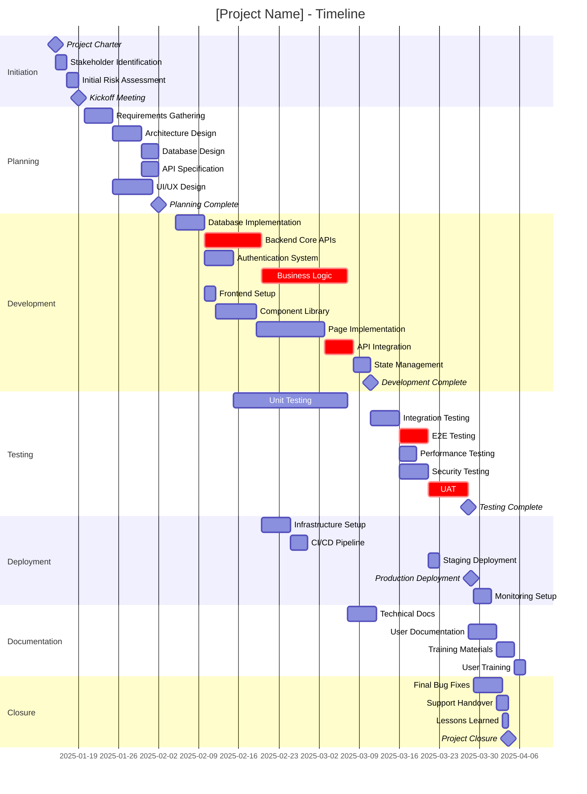
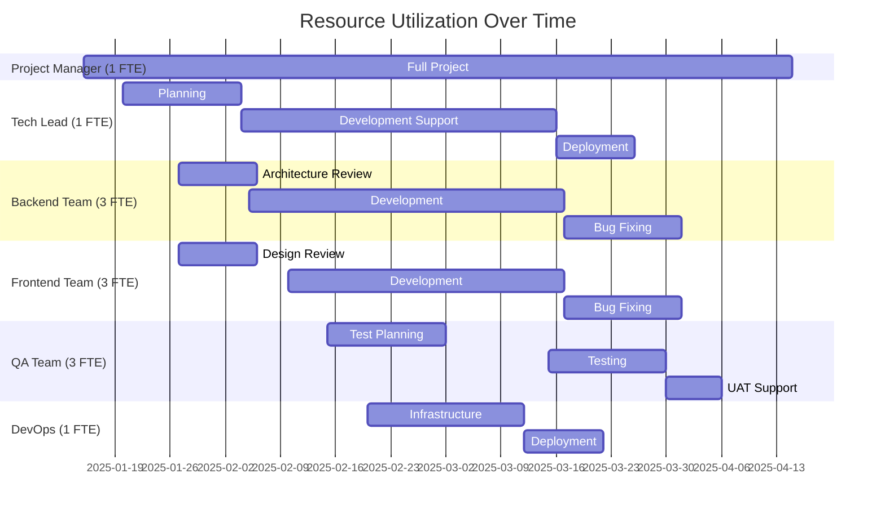
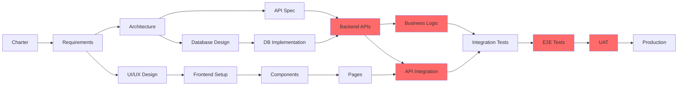

# Gantt Chart Template

**Project Name**: [Enter Project Name]
**Project ID**: [Unique Identifier]
**Timeline Version**: 1.0
**Date Created**: [YYYY-MM-DD]
**Created By**: [Name]

---

## Project Timeline

**Start Date**: [YYYY-MM-DD]
**Target End Date**: [YYYY-MM-DD]
**Total Duration**: [X] weeks ([Y] days)

### Gantt Chart



---

## Timeline Breakdown

### Phase 1: Initiation
**Duration**: 1 week (5 days)
**Start**: 2025-01-15
**End**: 2025-01-20

**Key Activities**:
- Project Charter development and approval
- Stakeholder identification and analysis
- Initial risk assessment
- Team kickoff meeting

**Milestone**: M2 - Kickoff Meeting Complete (2025-01-20)

**Critical Success Factors**:
- Clear project scope defined
- Stakeholder buy-in secured
- Team aligned on goals

---

### Phase 2: Planning
**Duration**: 2.5 weeks (18 days)
**Start**: 2025-01-20
**End**: 2025-02-07

**Key Activities**:
- Requirements gathering from stakeholders
- Technical architecture design
- Database schema design
- API contract specification
- UI/UX design and mockups

**Milestone**: M3 - Planning Complete (2025-02-07)

**Critical Success Factors**:
- Complete and approved requirements
- Architecture review passed
- Design stakeholder approval

**Parallel Tracks**:
- Database and API design can proceed in parallel after architecture
- UI/UX design parallel with technical architecture

---

### Phase 3: Development
**Duration**: 5.5 weeks (40 days)
**Start**: 2025-02-05
**End**: 2025-03-17

**Key Activities**:
- Backend: Database, APIs, Authentication, Business Logic
- Frontend: Setup, Components, Pages, Integration, State Management

**Milestone**: M4 - Development Complete (2025-03-17)

**Critical Success Factors**:
- All features implemented per specification
- Code reviews completed
- Unit tests written (80%+ coverage)
- Integration points working

**Critical Path Items** ⚠️:
- Backend Core APIs (dev2) - 10 days
- Business Logic (dev4) - 15 days
- API Integration (dev8) - 5 days

**Parallel Tracks**:
- Frontend and Backend development parallel after architecture
- Authentication system parallel with core API development

---

### Phase 4: Testing
**Duration**: 4 weeks (28 days)
**Start**: 2025-02-15 (overlaps with development)
**End**: 2025-03-30

**Key Activities**:
- Unit testing (ongoing with development)
- Integration testing
- End-to-end testing
- Performance testing
- Security testing
- User Acceptance Testing (UAT)

**Milestone**: M5 - Testing Complete (2025-03-30)

**Critical Success Factors**:
- All critical bugs resolved
- Performance benchmarks met
- Security vulnerabilities addressed
- UAT approval obtained

**Critical Path Items** ⚠️:
- E2E Testing (test3) - 5 days
- UAT (test6) - 7 days

**Testing Notes**:
- Unit testing runs parallel with development
- Integration testing after both frontend/backend complete
- UAT is final gate before production

---

### Phase 5: Deployment
**Duration**: 3 weeks (21 days)
**Start**: 2025-02-20 (overlaps with testing)
**End**: 2025-04-10

**Key Activities**:
- Production infrastructure provisioning
- CI/CD pipeline setup
- Staging environment deployment
- Production deployment (go-live)
- Monitoring and alerting setup

**Milestone**: M6 - Production Go-Live (2025-04-05)

**Critical Success Factors**:
- Zero-downtime deployment
- Monitoring active before go-live
- Rollback plan tested
- Support team ready

**Deployment Strategy**:
- Infrastructure setup can start early (parallel with development)
- Staging deployment after E2E testing passes
- Production deployment only after UAT approval

---

### Phase 6: Documentation
**Duration**: 3 weeks (15 days)
**Start**: 2025-03-10 (parallel with testing)
**End**: 2025-04-10

**Key Activities**:
- Technical documentation (architecture, API docs)
- User documentation (guides, FAQs)
- Training materials creation
- User training sessions

**Deliverables**:
- Complete technical documentation
- User manuals and guides
- Training materials
- Trained user base

**Documentation Notes**:
- Technical docs can start after development
- User docs after UAT (when final)
- Training sessions after production go-live

---

### Phase 7: Closure
**Duration**: 1.5 weeks (10 days)
**Start**: 2025-04-05
**End**: 2025-04-15

**Key Activities**:
- Post-launch bug fixes
- Handover to support team
- Lessons learned session
- Project closure report

**Milestone**: M7 - Project Closure (2025-04-15)

**Closure Checklist**:
- [ ] All deliverables accepted
- [ ] Support team trained
- [ ] Documentation complete
- [ ] Lessons learned documented
- [ ] Team recognition/celebration
- [ ] Budget reconciliation
- [ ] Project archived

---

## Key Milestones

| ID | Milestone | Target Date | Dependencies | Deliverables | Status |
|----|-----------|-------------|--------------|--------------|--------|
| M1 | Project Charter | 2025-01-15 | - | Signed charter | Not Started |
| M2 | Kickoff Complete | 2025-01-20 | Initiation phase | Aligned team | Not Started |
| M3 | Planning Complete | 2025-02-07 | All planning tasks | Requirements, designs | Not Started |
| M4 | Development Complete | 2025-03-17 | All dev tasks | Working software | Not Started |
| M5 | Testing Complete | 2025-03-30 | All test tasks | Test reports, UAT approval | Not Started |
| M6 | Production Go-Live | 2025-04-05 | Testing passed | Live system | Not Started |
| M7 | Project Closure | 2025-04-15 | All tasks complete | Closure report | Not Started |

---

## Critical Path Analysis

### Critical Path Sequence
```
M1 → init1 → init2 → M2 → plan1 → plan2 → plan4 → dev1 → dev2 → dev4 → test2 → test3 → test6 → M6 → close1 → close3 → M7
```

**Critical Path Duration**: 65 working days (~13 weeks)

### Critical Path Tasks

| Task ID | Task Name | Duration | Float | Impact if Delayed |
|---------|-----------|----------|-------|-------------------|
| plan1 | Requirements Gathering | 5d | 0d | Delays entire project |
| plan2 | Architecture Design | 5d | 0d | Delays development start |
| dev2 | Backend Core APIs | 10d | 0d | Blocks business logic |
| dev4 | Business Logic | 15d | 0d | Blocks testing |
| test3 | E2E Testing | 5d | 0d | Blocks UAT |
| test6 | UAT | 7d | 0d | Blocks production deployment |

**Float = 0 days** on all critical path tasks (any delay extends project)

### Near-Critical Paths

**Frontend Track** (2 days float):
- plan5 → dev5 → dev6 → dev7 → dev8
- Total: 29 days
- Risk: If delayed by >2 days, becomes critical path

**Testing Validation** (5 days float):
- test4 (Performance), test5 (Security)
- Can be delayed up to 5 days without impacting go-live

---

## Resource Timeline

### Team Loading by Phase



### Resource Summary

| Week | PM | TL | BE Dev | FE Dev | QA | DevOps | Total FTE |
|------|----|----|--------|--------|----|----|-----------|
| 1-2 (Initiation) | 1.0 | 0.5 | 0.3 | 0.2 | - | - | 2.0 |
| 3-4 (Planning) | 1.0 | 1.0 | 0.5 | 0.8 | - | - | 3.3 |
| 5-10 (Development) | 1.0 | 0.8 | 3.0 | 3.0 | 0.5 | 0.6 | 8.9 |
| 11-13 (Testing) | 1.0 | 0.5 | 1.5 | 1.5 | 3.0 | 0.8 | 8.3 |
| 14-15 (Deployment) | 1.0 | 1.0 | 0.5 | 0.5 | 1.0 | 1.0 | 5.0 |
| 16 (Closure) | 1.0 | 0.5 | - | - | - | - | 1.5 |

**Peak Resource Usage**: Week 5-10 (Development) - 8.9 FTE

---

## Dependencies Visualization

### High-Level Dependencies



**Legend**: Red nodes = Critical Path

---

## Risk Timeline

### Schedule Risks by Phase

| Phase | Risk | Probability | Impact | Mitigation |
|-------|------|-------------|--------|------------|
| Planning | Requirements change | Medium | High | Change control process |
| Development | Technical complexity | High | High | Proof of concepts early |
| Testing | Late defect discovery | Medium | Medium | Continuous testing |
| Deployment | Infrastructure issues | Low | High | Early environment setup |

### Buffer Allocation

- **Planning**: 2 days (10% buffer)
- **Development**: 8 days (15% buffer)
- **Testing**: 5 days (20% buffer)
- **Deployment**: 2 days (10% buffer)

**Total Contingency**: 17 days (19% of critical path)

---

## Progress Tracking

### How to Update This Timeline

#### Weekly Updates
1. Mark completed tasks with `:done` status
2. Mark current tasks with `:active` status
3. Adjust remaining task start dates based on actual progress
4. Update % complete in task descriptions

#### Example Updates
```mermaid
gantt
    # Completed task
    Requirements :done, req, 2025-01-20, 5d

    # In progress
    Architecture :active, arch, 2025-01-25, 5d

    # Not started (dates may shift)
    Development :dev, 2025-02-01, 20d
```

#### Baseline vs Actual
Keep original baseline for comparison. Create new Gantt with actual dates to show variance.

---

## Calendar Notes & Assumptions

### Working Days
- 5-day work weeks (Monday-Friday)
- 8-hour working days
- Excluding weekends and holidays

### Holidays & Time Off
- [List any known holidays in timeline]
- [Note any planned team absences]

### Capacity Assumptions
- Team members available 100% (adjust if part-time)
- No major competing priorities
- Meetings/overhead already factored in (~15%)

---

## Export & Integration

### Viewing This Gantt Chart
- Renders in GitHub/GitLab markdown files
- Use Mermaid Live Editor: https://mermaid.live
- VS Code with Mermaid extension
- Export to PDF for stakeholder sharing

### Integration with Project Tools
- **Jira/Asana**: Create issues from task list
- **MS Project**: Import task dates and dependencies
- **Google Sheets**: Copy milestone table
- **Confluence**: Embed this markdown file

---

## Notes & Updates

### Version History

| Version | Date | Author | Changes |
|---------|------|--------|---------|
| 1.0 | [Date] | [Name] | Initial timeline |

### Assumptions
- Team ramp-up time included in early tasks
- No major scope changes after planning
- Third-party dependencies available on time
- Infrastructure provisioning has no delays

### Constraints
- Hard deadline: [Date if applicable]
- Budget cap: $[Amount]
- Fixed team size: [X] FTE
- Technology stack: [List]

---

**Template Version**: 1.0
**Part of**: Puerto AI Project Management System Plugin
**Mermaid Version**: Compatible with Mermaid 9.0+
**Usage**: Customize task names, dates, and durations for your project
